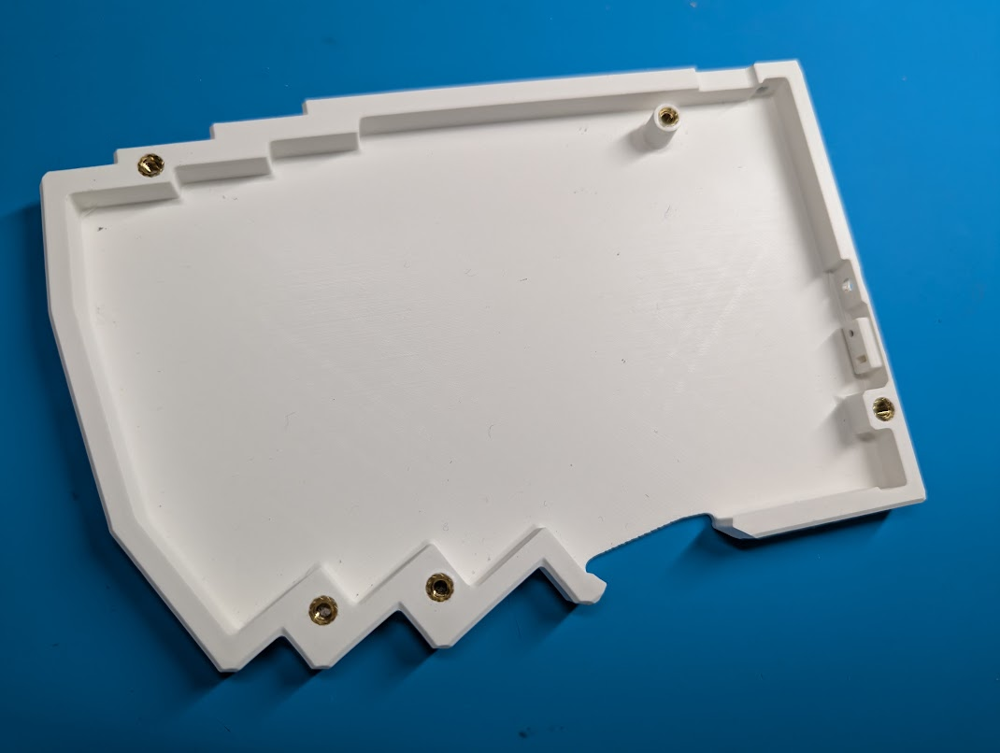
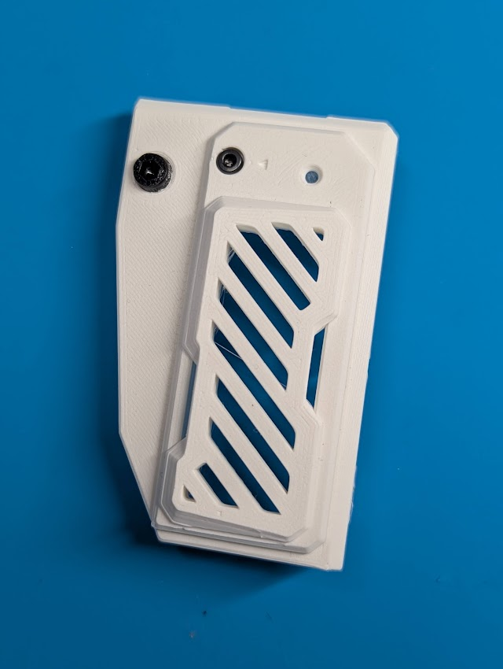
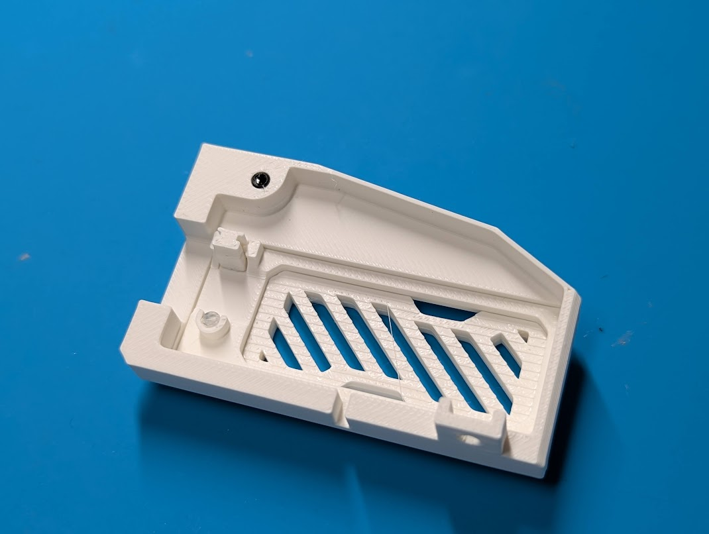
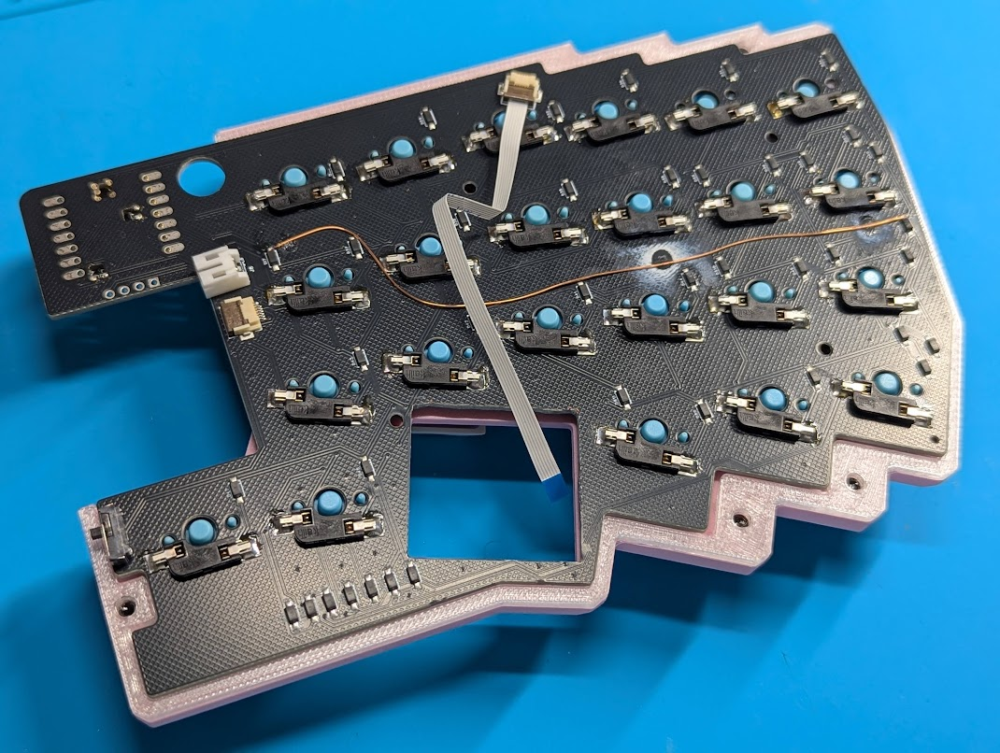
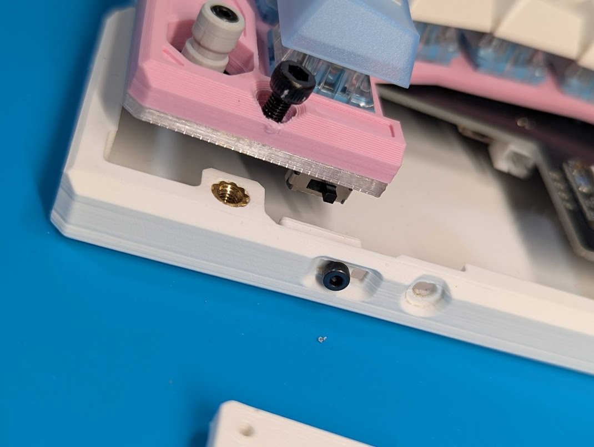
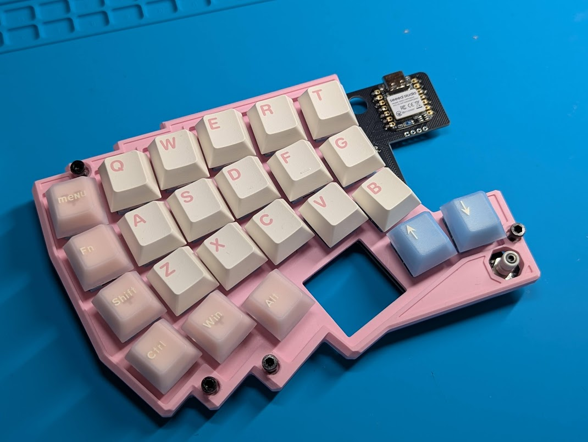
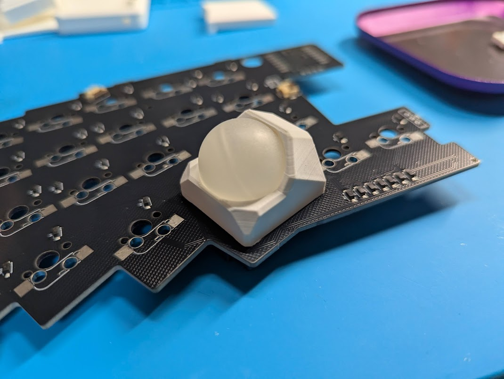
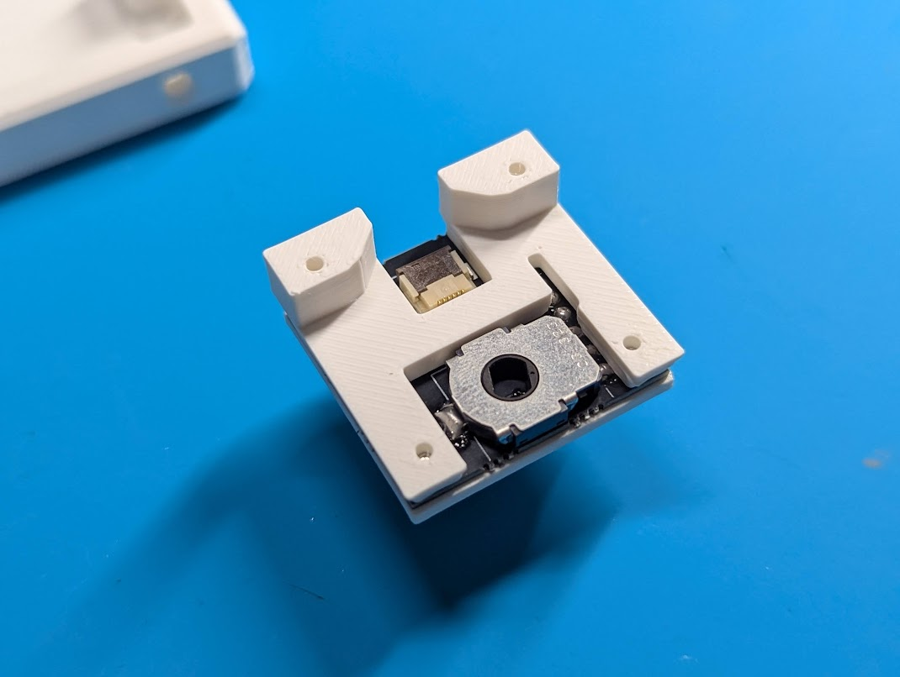
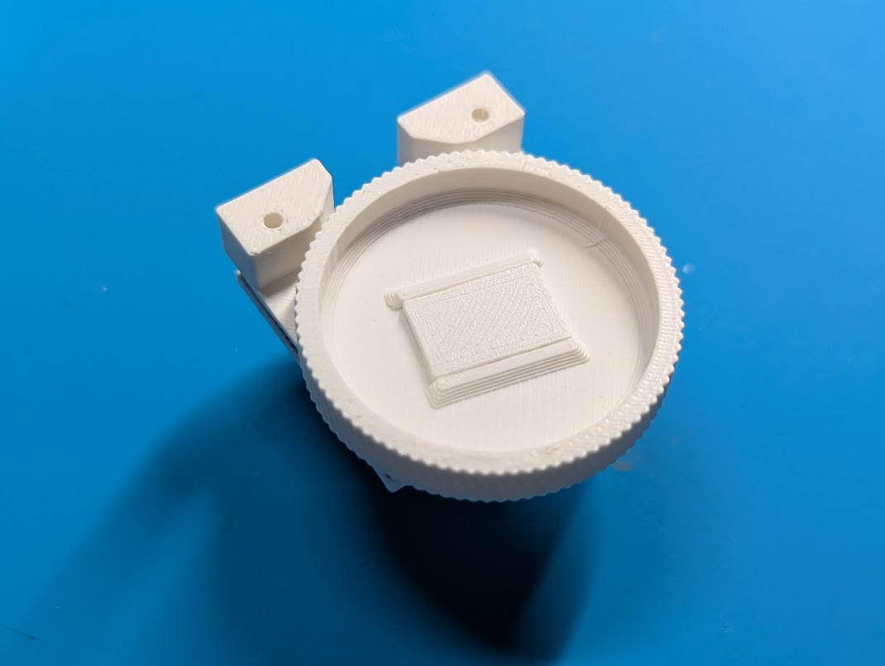
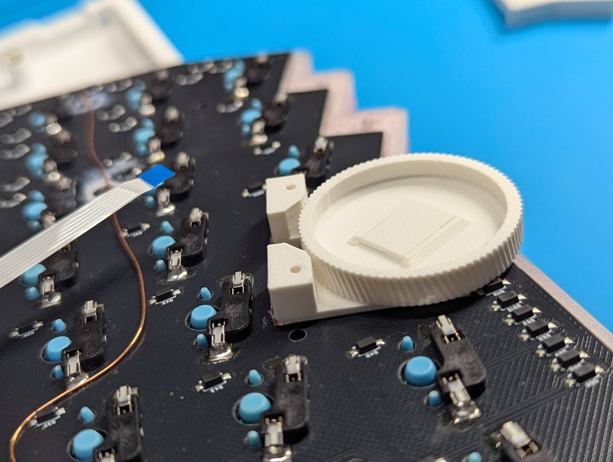

## 購入前チェック

| 確認項目 | この製品で必要なもの・注意点 |
| --- | --- |
| スイッチ・キーキャップ | 46個。MX互換またはKailh Choc V2互換。キーキャップは選択したステムに対応する通常ピッチ用 |
| 取り付け方法 | MX互換はソケット対応（ソケット46個は別途用意）。Choc V2互換は基板へ直接はんだ付け |
| 電源 | 3.7V LiPoバッテリーを左右各1個、計2個。ケースに収まる寸法とコネクタの極性を購入前に確認 |
| モジュール | 使用するMeKaBuモジュールと専用ガスケットを確認。本ページの部品表はSparAkasha専用部品のみ |

## 作業を始める前に

1. 注文したキットの構成と部品表を照合します。実装済みの部品へのはんだ付けは不要です。
2. はんだ付けや配線・FFCケーブルの抜き差しは、USBと電池を外して行います。電源スイッチをOFFにするだけでは作業しないでください。
3. 部品の取り付け面・向き・極性を、基板の印字と各手順の写真で確認します。写真と手元の基板が異なる場合は加工せず、基板の版とキット内容を確認してください。
4. 通電前に、はんだのブリッジ、切り残したリード線、ケーブルの挟み込みがないか確認します。

書き込み方法と接続トラブルの切り分けは、[ファームウェア取り扱いガイド](../90firmwareguide/)を参照してください。

## SparAkasha部品表

SparAkasha専用の部品のみ記載
|部品名|ユニット|使用数量|
|---|---|---|
|メイン基板（L）|メイン基板/電子部品|1|
|メイン基板（R）|メイン基板/電子部品|1|
|トップケース（L）|メインケース|1|
|トップケース（R）|メインケース|1|
|ボトムケース（L）|メインケース|1|
|ボトムケース（R）|メインケース|1|
|ボトムケースベゼル穴埋めカバー|メインケース|2|
|電源スイッチ補助部品|メインケース|2|
|リセットスイッチ補助部品|メインケース|2|
|■M3_インサートナット|メインケース|10|
|■M3_CAP（L:6mm）|メインケース|10|
|ENC、TB用モジュールガスケット|その他|1|
|薄型エンコーダーノブ|アナログスティック&エンコーダモジュール|1|
|ボトムハウジング|アナログスティック&エンコーダモジュール|1|

⚠️キースイッチ用ソケットは付属しません

### その他必要なもの

| 名前 | 個数・条件 |
| --- | --- |
| キースイッチ | 46個（MX互換またはKailh Choc V2互換） |
| MX用キーソケット | 46個（MX互換スイッチを使用する場合のみ） |
| キーキャップ | 46個（選択したスイッチのステムに対応・通常ピッチ用） |
| LiPoバッテリー | 2個（3.7V、左右各1個） |

⚠️ MX互換スイッチはソケットに対応します。Kailh Choc V2互換スイッチは、基板へ直接はんだ付けしてください。

⚠️ LiPoバッテリーは極性を確認し、短絡・過充電・過放電を避けてください。膨張、異臭、異常な発熱がある場合は使用しないでください。

## ケースデータについて
[こちら](https://github.com/te9no/SparAkasha)で公開しています。


## PCBの組立

### 組み立て方

MeKaBuの組立手順と共通の部分があります。本ページではSparAkasha固有の取り付け面・向き・ケースの組立を説明します。共通手順の案内が手元にない場合は、はんだ付け前に購入時の資料を確認してください。

MXスイッチのみソケットに対応しています

Choc V2スイッチを使用する場合は、スイッチを基板へ直接はんだ付けしてください

電源スイッチはMeKaBuと取り付け面が逆です


方向スイッチはシルクの▲が切り欠きに対応します。


## ケースの組立

### インサートナットの挿入

左右のケースにM3インサートナットを5個ずつ、計10個取り付けます。ナットが傾かないように挿入し、こて先がケース底面を貫通しないよう注意してください。



### 電源スイッチアダプタの取り付け

上下の向きに注意して、ネジ穴が下によってる方が下側になるようにしてねじ止めする

※写真は左側ケース


### ケースカバーの組立

写真を参考にM3CAP、M2キャップ、リセットスイッチアダプタ、マイコンカバー、バッテリーカバー、透明棒を組み合わせる





### ケーススペーサの取り付け

ケーススペーサが付属している場合は以下の写真を参考に接着剤などで固定して下さい

⚠️ダイオードと干渉しないように注意


### ケースガスケットの取り付け

MXスイッチを使用する場合はケースガスケットをはめ込む

左右別なので注意、上部にケースとかみ合う突起があります

※写真の空中配線は気にしないでください



### ボトムとトップケースの組立

電源スイッチアダプタに電源スイッチノブが差し込まれるように載せる

差し込まれないまま、無理に組み合わせると折れるので注意

差し込まれにくいときは電源スイッチを左右に動かすと差し込まれます



### ケースねじ止め

M3 × 6mmネジを使用してねじ止めする



## モジュールの組立

### エンコーダモジュール

共通部分は[MeKaBuモジュール組み立てガイド](https://modulable-keyboard-developer.github.io/guides/04module/)を参照してください。

ガスケットを装着する


### トラックボールモジュール

ボトムハウジングとトップハウジングはMeKaBuと共通

ガスケットを装着する


M2タップとマグネットをMeKaBu同様に取り付けたら組付けられます



### アナログスティック＆エンコーダモジュール

部品を写真の配置に並べ、薄型エンコーダノブとボトムハウジングを確認します。



次の写真を参考に、部品の位置を合わせて組み付けます。



組み付け後、部品が傾いたり干渉したりしていないか、次の写真と照合します。


薄型エンコーダノブと軸が外れやすい場合は、仮組みで位置と回転を確認してから接着剤で固定します。可動部に接着剤が入らないようにしてください。

取り付け方向を次の写真で確認します。



MXスイッチを使用する場合はボトムケースに上げ底アダプタをはめ込む


## ファームウェアについて

ファームウェアはMeKaBuと共通になります。

キーボード名を変えたい場合は以下ファイルを修正してください。

/boards/shields/MKB/Kconfig.defconfig

```
#before
config ZMK_KEYBOARD_NAME
    default "MeKaBu"

```

```
#after
config ZMK_KEYBOARD_NAME
    default "SparAkasha"

```
