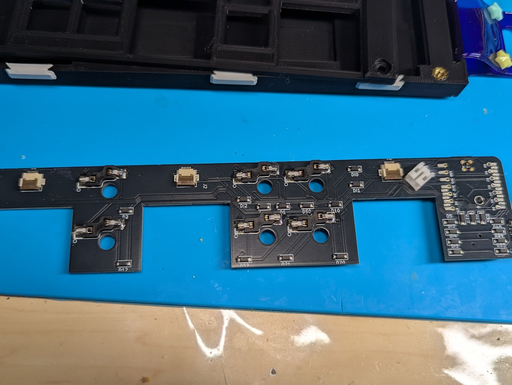
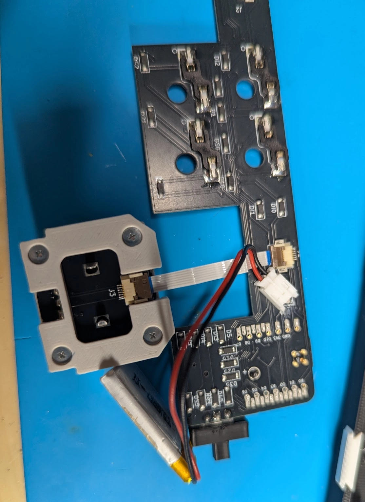

# キット内容物

| 名前 | 個数 | 備考 |
| --- | --- | --- |
| PCB | 1 |  |
| ボトムケース | 1 |  |
| トップケース | 1 |  |
| 方向スイッチノブ | 1 |  |
| 電源スイッチアダプタ | 1 |  |
| Xiao nRF52840 Plus | 1 |  |
| スライドスイッチ | 1 |  |
| PHコネクタ | 1 |  |
| ボトムケースカバー | 3 |  |
| FFCケーブル | 3 |  |
| キースイッチソケット（ChocV2用） | 6 |  |
| 5方向スイッチ  | 1 |  |
| M3ボルト | 4 |  |
| M3インサートナット | 4 |  |
| 透明ソフトプラ丸棒 | 1 | 切って使用する |
| 17mmキーキャップ | 6 | おまけ |

## その他必要なもの

| 名前 | 備考 |
| --- | --- |
| ハンダ付け用品 | おすすめはこちらに
[🔥某なれはて流・失敗しないハンダメソッド](https://note.com/teporz/n/n470c54151472) |
| MeKaBuモジュール | 同種モジュールは使用不可
[MeKaBu Project - BOOTH](https://mekabukb.booth.pm/) |
| キースイッチ | 6個 |
| キーキャップ | 17mmピッチ、お好みで |
| LiPOバッテリー | 502030以下推奨 |

# 基板組み立て

## ソケットのハンダ付け

ソケットの向きに注意しながらハンダ付けする。

## マイコン、スライドスイッチ、方向スイッチのハンダ付け

取り付ける面をよく確認してからずれないようにハンダ付けする。

方向スイッチは切り欠きの向きに注意してハンダ付けする。

## PHコネクタのハンダ付け

そのままつけるとFFCコネクタに干渉するので気合で曲げて、良い位置に調整してからはんだ付けする。

# ケースの組立

## インサートナットの取り付け

内径が小さい方を下にしてインサートナットを穴に置く。

加熱したはんだごてを使用して溶かしながら押し込んでいく。

※こて先が細くインサートナットの穴の中を貫通するものを使用する場合、ボトムケースの底に穴が開く可能性があるので注意。

## モジュールカバーの取り付け

アナログスティックモジュール以外を使用する場合はボトムケースの切欠き部分にカバーを取り付ける。

## モジュールの取り付け

モジュールの組立については以下を参照すること。

[MeKaBuモジュール組み立てガイド](https://www.notion.so/MeKaBu-2dfdd052773581c99758eb9905acce06?pvs=21)

モジュールにFFCケーブルを取り付けてから、PCBにFFCケーブルを接続する。

左スロットについては、FFCケーブルをPCBに接続してからバッテリーケーブルをPHコネクタに接続すること。（逆にするとFFCケーブル・コネクタに無理な負荷がかかります。）

## 電源スイッチの取り付け

向きに注意して、差し込む

# 全体組立

## ケース組立

トップケースを配置して、M3ボルトでねじ止めする。

方向スイッチノブを取り付ける。（無理に押し込むと破損しますので注意。）

# ファームウェア

ファームウェアは開発中のものです。カスタマイズは歓迎いたします。

モジュールについてもこういった機能が欲しいという要望があれば、DM等でお知らせください！

[https://github.com/te9no/zmk-config-MRM](https://github.com/te9no/zmk-config-MRM)
