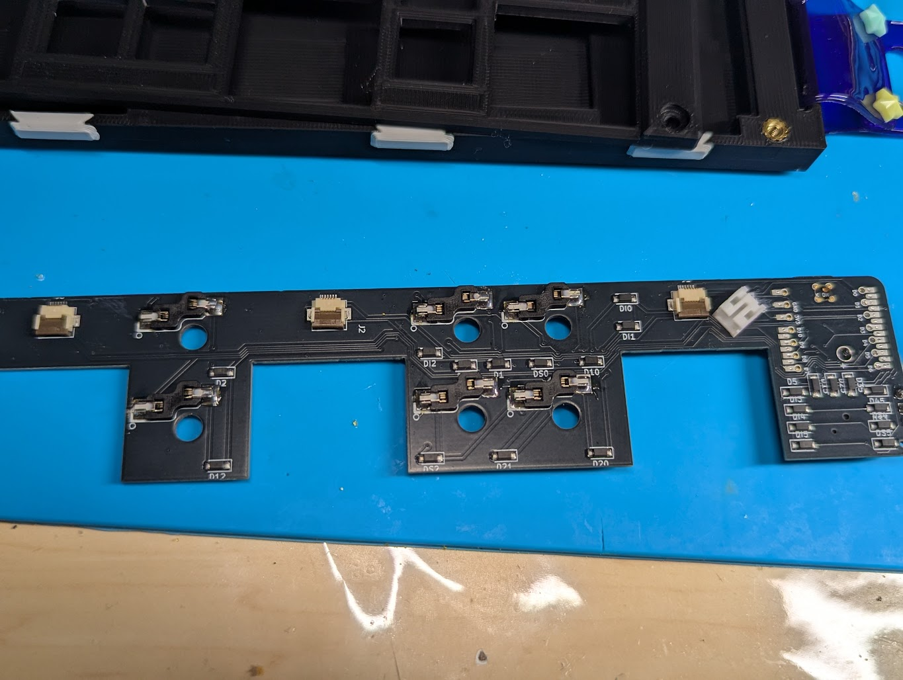
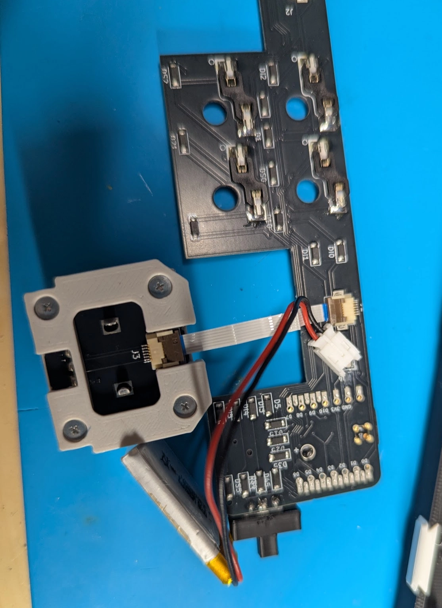

## 購入前チェック

| 確認項目 | この製品で必要なもの・注意点 |
| --- | --- |
| スイッチ | Kailh Choc V2互換 ×6。Choc V2用ソケット ×6はキットに付属 |
| キーキャップ | 17mmピッチ用 ×6。交換する場合はMX型十字ステム対応品を用意。おまけのキーキャップが付属 |
| 電源 | 3.7V LiPoバッテリー ×1（502030以下を推奨） |
| モジュール | MeKaBuモジュールを別途用意。同種モジュールの同時使用は本ガイドの対応範囲外。使用スロットとファームウェアの組み合わせを確認 |

## 作業を始める前に

1. 注文したキットの構成と部品表を照合します。実装済みの部品へのはんだ付けは不要です。
2. はんだ付けや配線・FFCケーブルの抜き差しは、USBと電池を外して行います。電源スイッチをOFFにするだけでは作業しないでください。
3. 部品の取り付け面・向き・極性を、基板の印字と各手順の写真で確認します。写真と手元の基板が異なる場合は加工せず、基板の版とキット内容を確認してください。
4. 通電前に、はんだのブリッジ、切り残したリード線、ケーブルの挟み込みがないか確認します。

書き込み方法と接続トラブルの切り分けは、[ファームウェア取り扱いガイド](../90firmwareguide/)を参照してください。

## キット内容物

| 名前 | 個数 | 備考 |
| --- | --- | --- |
| PCB | 1 |  |
| ボトムケース | 1 |  |
| トップケース | 1 |  |
| 方向スイッチノブ | 1 |  |
| 電源スイッチアダプタ | 1 |  |
| Seeed Studio XIAO nRF52840 Plus | 1 |  |
| スライドスイッチ | 1 |  |
| PHコネクタ | 1 |  |
| ボトムケースカバー | 3 |  |
| FFCケーブル | 3 |  |
| キースイッチソケット（Choc V2用） | 6 | キットに付属 |
| 5方向スイッチ  | 1 |  |
| M3ボルト | 4 |  |
| M3インサートナット | 4 |  |
| 透明ソフトプラ丸棒 | 1 | 切って使用する |
| 17mmキーキャップ | 6 | おまけ |

### その他必要なもの

| 名前 | 備考 |
| --- | --- |
| はんだ付け用品 | おすすめは[🔥某なれはて流・失敗しないはんだメソッド](https://note.com/teporz/n/n470c54151472) |
| MeKaBuモジュール | 同種モジュールは使用不可。[MeKaBu Project - BOOTH](https://mekabukb.booth.pm/) |
| Kailh Choc V2互換キースイッチ | 6個（本体には付属しません） |
| 1Uキーキャップ | 6個（MX型十字ステム対応・17mmピッチ用。キット付属のおまけから交換する場合） |
| LiPoバッテリー | 1個（3.7V、502030以下を推奨） |

⚠️ LiPoバッテリーは極性を確認し、短絡・過充電・過放電を避けてください。膨張、異臭、異常な発熱がある場合は使用しないでください。

## 基板組み立て

### ソケットのはんだ付け

ソケットの向きに注意しながらはんだ付けする。

### マイコン、スライドスイッチ、方向スイッチのはんだ付け

取り付ける面をよく確認してからずれないようにはんだ付けする。

方向スイッチは切り欠きの向きに注意してはんだ付けする。

### PHコネクタのはんだ付け

PHコネクタをそのまま取り付けるとFFCコネクタに干渉します。バッテリーを接続せず、写真を参考に端子を曲げて位置を調整します。FFCケーブルの抜き差しを妨げないこと、隣接端子と接触しないことを仮合わせで確認してからはんだ付けしてください。

## ケースの組立

### インサートナットの取り付け

内径が小さい方を下にしてインサートナットを穴に置く。

加熱したはんだごてを使用して溶かしながら押し込んでいく。

※こて先が細くインサートナットの穴の中を貫通するものを使用する場合、ボトムケースの底に穴が開く可能性があるので注意。

### モジュールカバーの取り付け

アナログスティックモジュール以外を使用する場合はボトムケースの切欠き部分にカバーを取り付ける。

### モジュールの取り付け

モジュールの組立については以下を参照すること。

[MeKaBuモジュール組み立てガイド](https://modulable-keyboard-developer.github.io/guides/04module/)

モジュールにFFCケーブルを取り付けてから、PCBにFFCケーブルを接続する。

左スロットについては、FFCケーブルをPCBに接続してからバッテリーケーブルをPHコネクタに接続すること。（逆にするとFFCケーブル・コネクタに無理な負荷がかかります。）

バッテリーの接続は、すべてのはんだ付けとFFCケーブルの接続・点検が終わってから行ってください。

### 電源スイッチの取り付け

向きに注意して、差し込む

## 全体組立

### ケース組立

トップケースを配置して、M3ボルトでねじ止めする。

方向スイッチノブを取り付ける。（無理に押し込むと破損しますので注意。）

## ファームウェア

ファームウェアは開発中のものです。カスタマイズは歓迎いたします。

モジュールについてもこういった機能が欲しいという要望があれば、DM等でお知らせください！

[https://github.com/te9no/zmk-config-MRM](https://github.com/te9no/zmk-config-MRM)

2026年8月30日の[build.yaml](https://github.com/te9no/zmk-config-MRM/blob/HEAD/build.yaml)では、通常動作用の成果物名は `MRM_TB_TPD_ENC` です。これはSlot1がトラックボール、Slot2がトラックパッド、Slot3がエンコーダの構成です。コメントアウトされた構成は、その状態ではビルドされません。

スロット番号と実際の取り付け位置を配布資料で照合し、異なる構成では対応するビルドを用意してください。ファイル名だけを変更してもモジュール構成は変わりません。

書き込み手順は[ファームウェア取り扱いガイド](../90firmwareguide/)を参照してください。書き込み後は、すべてのキーと搭載モジュールの動作を確認します。
