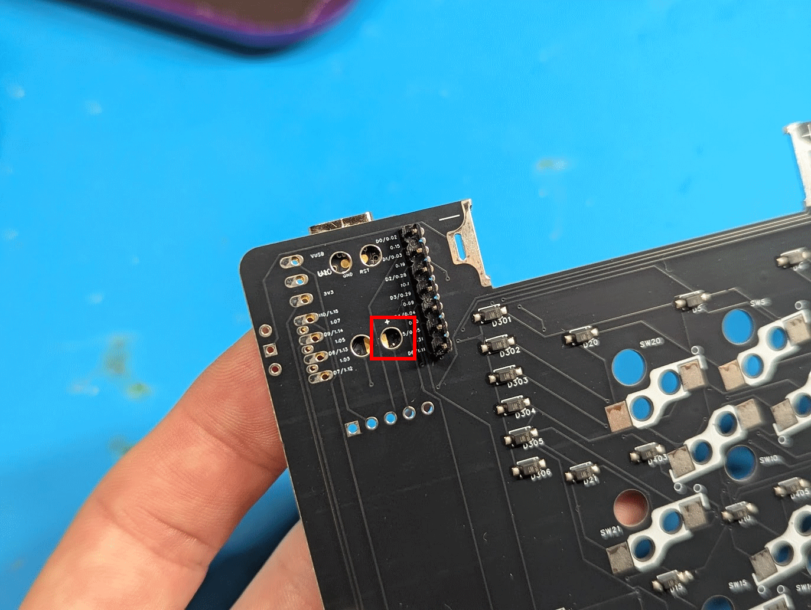
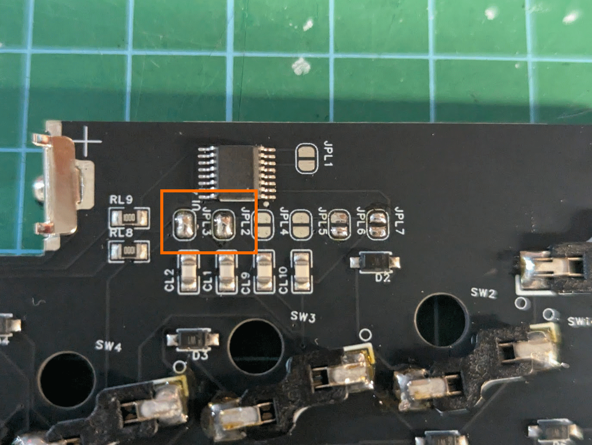

# GeaconPolaris 購入ガイド

GeaconPolarisには複数の購入オプションや注意事項があります。  
本ガイドをよくお読みのうえ、ご注文ください。

---

## ① 本体キットの選び方

本体キットは以下から購入します。  
👉 [GeaconPolaris 本体キット（Booth）](https://te9no.booth.pm/items/7995609) 

### ■ キットの種類

**● PCB・電子部品キット（印刷部品なし）**  
ケースなどの3Dプリント部品は付属しません。

---

## ② 半組キット・ケース付き・完成品にする方法  

追加で「サポート用」商品を購入することで構成を変更できます。  
👉 [GeaconPolaris サポート用オプション](https://te9no.booth.pm/items/8017110)  

### ■ オプション一覧

- **半組キット（ソケット以外は半田付け済み）**  
  → 「100円」×30個（+3,000円）

- **ケース付きキット**  
  → 「100円」×20個（+2,000円）

- **半組 ＆ ケース付きキット**  
  → 「100円」×50個（+5,000円）

- **完成済みセット（すべての部品をはんだ付けして組立済み）**  
  → 「100円」×110個（+11,000円）
  ※こちらもモジュールは付きません。

### ■ 注意事項

- 購入数によって構成が変わる仕組みです。  
  **数量の選択ミスにご注意ください。**

- 本体キットと同時に購入してください。

- 購入後、**メッセージで希望するオプション内容を必ずお知らせください。**  
  ご連絡がない場合、**注文がキャンセルとなる場合があります。**

---

## ③ アクセントプレートについて

ケース付きキット・完成済みセットには、  
**ゴールド（PETG）製アクセントプレート**が標準で付属します。

別カラーをご希望の場合は以下から購入してください。  
👉 [GeaconPolaris アクセントプレート](https://te9no.booth.pm/items/8236414)  

### ■ ポイント
- 本体キットと同時購入で**同梱発送可能**。
- 別注文だと送料が追加でかかります。

---

## ④ モジュールについて

GeaconPolaris本体キットには**モジュールは付属しません。**

以下のモジュールが使用可能です。

### ■ 対応モジュール
- トラックボール  
- エンコーダ  
- アナログスティック＆エンコーダ  

※右手側は**トラックボールのみ対応**です。

モジュールは以下から購入してください。  
👉 [MeKaBu Project](https://mekabukb.booth.pm/)  

### ■ 注意事項（モジュール）

- 他のモジュールも物理的には接続可能な場合がありますが、  
  **搭載方法についてはサポート対象外**です。
- 初めての方は上記対応モジュールの使用を推奨します。

---

## ⑤ 注意事項

ご注文前に必ずご確認ください。

- **「サポート用」商品のみの購入は無効です。**  
  本体キットと同時にご購入ください。  
  単体で購入された場合はキャンセルとなります。  
  ※その際の手数料は購入者負担となります。

- **アクセントプレート単体での購入は可能です。**  
  その場合は**アクセントプレートのみの発送**となります。  

---

# キット内容物

| 名前 | 個数 | 備考 |
| --- | --- | --- |
| PCB（L） | 1 |  |
| PCB（R） | 1 |  |
| Xiao nRF52840 Plus | 2 |  |
| スライドスイッチ | 2 |  |
| 電池端子（＋） | 2 |  |
| 電池端子（ー） | 2 |  |
| FFCケーブル | 2 |  |
| キースイッチソケット（ChocV2用） | 46 |  |
| 5方向スイッチ  | 1 |  |
| マウススイッチ | 3 |  |
| M3ボルト | 8 |  |
| M3インサートナット | 8 |  |
| 透明ソフトプラ丸棒 | 1 | 切って使用する |
| OLED | 1 |  |
| ネオジウム磁石（3*2㎜） | 2 |バッテリーカバー用|
| M2ネジ | 2 |タッチセンサー用|

## その他必要なもの

| 名前 | 備考 |
| --- | --- |
| ハンダ付け用品 | おすすめは[🔥某なれはて流・失敗しないハンダメソッド](https://note.com/teporz/n/n470c54151472) |
| MeKaBuモジュール | 右手はトラックボールのみ使用可能 [MeKaBu Project - BOOTH](https://mekabukb.booth.pm/) |
| キースイッチ | 46個 |
| キーキャップ | 17mmピッチ |
| 単4電池 | 左右それぞれ1個。NiMH電池を使用してください。 |
| グリップラスなどの滑り止め | おすすめは[こちら](https://amzn.to/4s9S68a) |

# 印刷物
ケースデータはこちらに→[Github](https://github.com/te9no/zmk-config-GeaconPolaris/)
| 名前 | 個数 | 備考 |
| --- | --- | --- |
| ボトムケース（L） | 1 |  |
| ボトムケース（R） | 1 |  |
| トップケース（L） | 1 |  |
| トップケース（R） | 1 |  |
| プレート（L） | 1 |  |
| プレート（R） | 1 |  |
| バッテリーカバー | 2 |  |
| 方向スイッチノブ | 1 |  |
| マウスボタン | 1 |  |
| リセットスイッチボタン | 2 |  |
| 電源スイッチアダプタ（L） | 1 |  |
| 電源スイッチアダプタ（R） | 1 |  |

[25mmボール用ケースのデータ](https://github.com/te9no/MeKaBu-public-data/blob/main/mechanical_data/TB/torabo25mm_top.stl)

# 基板組み立て

## ソケットのハンダ付け

ソケットの向きに注意しながらハンダ付けする。

## マイコンのハンダ付け

取り付ける面をよく確認してからずれないようにハンダ付けする。

マイコンの背面パッドはBat+をハンダ付けする。（赤枠内の部分）
⚠️パッドとスルーホールの両方がハンダ付けされて、導通するようにしてください。

## タッチセンサー用ジャンパのハンダ付け
※左手側基板のみ。
JPL2,3を導通するようにハンダ付けする。

## 電源昇圧基板のハンダ付け

取り付ける面をよく確認してからずれないようにハンダ付けする。
⚠️本体基板と電源昇圧基板の四角のパッドが一致します。
⚠️写真のように電源昇圧基板の上端までハンダが綺麗に乗るようにしてください。
　側面だけだと、導通不良を起こしやすいです。

## 電池端子のハンダ付け
⚠️ソケットを取り付けた後に取り付けること。

電池端子は足を折り曲げる。

底につくようにして、基板と垂直になるようにハンダ付けする。

## OLEDのハンダ付け
※左手側基板のみ。
基板と水平になるようにしてハンダ付けする。
⚠️足はなるべく短くなるようにカットすること。

## 方向スイッチのハンダ付け
※左手側基板のみ。

切り欠きの向きに注意してハンダ付けする。
⚠️本体基板の▲と方向スイッチの切り欠きが一致します。

## スライドスイッチのハンダ付け

取り付ける面をよく確認してからハンダ付けする。

## マウススイッチのハンダ付け
※左手側基板のみ。

向きに注意してハンダ付けする。

## タッチセンサーの取り付け
※左手側基板のみ。

タッチセンサーボタンをねじ止めする。

# ケースの組立

## インサートナットの取り付け

内径が小さい方を下にしてインサートナットを穴に置く。
加熱したはんだごてを使用して溶かしながら押し込んでいく。
※こて先が細くインサートナットの穴の中を貫通するものを使用する場合、ボトムケースの底に穴が開く可能性があるので注意。

## モジュールカバーの取り付け

アナログスティックモジュール以外を使用する場合はボトムケースの切欠き部分にカバーを取り付ける。
⚠️向きに注意すること。

## モジュールの取り付け

モジュールの組立については以下を参照すること。

[MeKaBuモジュール組み立てガイド](https://modulable-keyboard-developer.github.io/guides/04module/)

モジュールにFFCケーブルを取り付ける。

ボトムケースにモジュールハウジングがしっかりはまり込むように取り付ける。

# 透明プラ棒の取り付け
差し込む。ケース内側の側は面一～ちょっと飛び出るくらいで十分です。
⚠️長すぎるとマイコンの表面部品を蹴飛ばす可能性があるため注意。

## 電源スイッチの仮固定
電源スイッチにはまるように配置する。

## リセットボタンの仮固定
リセットボタンの向きに注意してケースに差し込む。
マスキングテープなどでリセットボタンが飛んでいかないように貼り付ける。

## バッテリーカバーの組立
マグネットを圧入する

# 全体組立

## モジュールの接続

PCBにモジュールから伸びたFFCケーブルを接続する。

## ケース組立

プレートを配置する

マウスボタンを取り付ける

トップケースを配置する

ケースをねじ止めする

バッテリーカバー用ネジを取り付ける
