## 購入前チェック

| 確認項目 | この製品で必要なもの・注意点 |
| --- | --- |
| スイッチ・キーキャップ | MX互換／Kailh Choc V2互換／ALPS互換から選択して各46個。キーキャップは選んだステムに対応する通常ピッチ用 |
| 取り付け方法 | MX互換は別途MX用ソケット ×46を用意。Choc V2互換・ALPS互換は基板へ直接はんだ付け |
| 電源 | 単3形Ni-MH充電池を左右各1個、計2個。一次電池は使用しない |
| ケース・モジュール | 基本キットに印刷部品・モジュールは付属しない。IQSモジュールを取り付ける場合はOLEDを取り付けない |

## 作業を始める前に

1. 注文したキットの構成と部品表を照合します。実装済みの部品へのはんだ付けは不要です。
2. はんだ付けや配線・FFCケーブルの抜き差しは、USBと電池を外して行います。電源スイッチをOFFにするだけでは作業しないでください。
3. 部品の取り付け面・向き・極性を、基板の印字と各手順の写真で確認します。写真と手元の基板が異なる場合は加工せず、基板の版とキット内容を確認してください。
4. 通電前に、はんだのブリッジ、切り残したリード線、ケーブルの挟み込みがないか確認します。

書き込み方法と接続トラブルの切り分けは、[ファームウェア取り扱いガイド](../90firmwareguide/)を参照してください。

## SparAkashaAnanta 購入ガイド

SparAkashaAnantaには複数の購入オプションや注意事項があります。  
本ガイドをよくお読みのうえ、ご注文ください。

---

### ① 本体キットの選び方

本体キットは以下から購入します。  
👉 [SparAkashaAnanta 本体キット（Booth）](https://te9no.booth.pm/items/8305059) 

#### ■ キットの種類

**● PCB・電子部品キット（印刷部品なし）**  
ケースなどの3Dプリント部品は付属しません。

---

### ② 半組キット・ケース付き・完成品にする方法

追加で「サポート用」商品を購入することで構成を変更できます。  
👉 [サポート用オプション](https://te9no.booth.pm/items/8017110)  

#### ■ オプション一覧

- **半組キット（ソケット以外ははんだ付け済み）**\
  → 「100円」×30個（+3,000円）

- **ケース付きキット**  
  → 「100円」×20個（+2,000円）

- **半組 ＆ ケース付きキット**  
  → 「100円」×50個（+5,000円）

- **完成済みセット（すべての部品をはんだ付けして組立済み）**  
  → 「100円」×110個（+11,000円）
  ※こちらもモジュールは付きません。

#### ■ 注意事項

- 購入数によって構成が変わる仕組みです。  
  **数量の選択ミスにご注意ください。**

- 本体キットと同時に購入してください。

- 購入後、**メッセージで希望するオプション内容を必ずお知らせください。**  
  ご連絡がない場合、**注文がキャンセルとなる場合があります。**

---

### ③ モジュールについて

SparAkashaAnanta本体キットには**モジュールは付属しません。**

以下のモジュールが使用可能です。

#### ■ 対応モジュール
- トラックボール  
- エンコーダ  
- アナログスティック＆エンコーダ  
- 1uKeyモジュール
- トラックパッドモジュール

モジュールは以下から購入してください。  
👉 [MeKaBu Project](https://mekabukb.booth.pm/)  
👉 [なれはてぷれいぐらうんど](https://te9no.booth.pm/)  

---

### ④ 注意事項

ご注文前に必ずご確認ください。

- **「サポート用」商品のみの購入は無効です。**  
  本体キットと同時にご購入ください。  
  単体で購入された場合はキャンセルとなります。  
  ※その際の手数料は購入者負担となります。

---

## キット内容物

| 名前 | 個数 | 備考 |
| --- | --- | --- |
| PCB（L） | 1 |  |
| PCB（R） | 1 |  |
| Seeed Studio XIAO nRF52840 Plus | 2 |  |
| スライドスイッチ | 2 |  |
| 電池端子（＋） | 2 |  |
| 電池端子（ー） | 2 |  |
| FFCケーブル | 2 |  |
| 5方向スイッチ  | 2 |  |
| M3ボルト | 10|  |
| M3インサートナット | 10 |  |
| 透明ソフトプラ丸棒 | 1 | 切って使用する |
| OLED | 2 |  |

### その他必要なもの

| 名前 | 備考 |
| --- | --- |
| はんだ付け用品 | おすすめは[🔥某なれはて流・失敗しないはんだメソッド](https://note.com/teporz/n/n470c54151472) |
| MeKaBuモジュール |  |
| キースイッチ（MX互換／Kailh Choc V2互換／ALPS互換のいずれか） | 46個 |
| MX用キーソケット | 46個（MX互換スイッチを使用する場合のみ） |
| キーキャップ | 46個（選択したスイッチのステムに対応・通常ピッチ用） |
| 単3形Ni-MH充電池 | 2個（左右各1個。アルカリ乾電池などの一次電池は使用しないでください） |
| グリップラスなどの滑り止め | おすすめは[こちら](https://amzn.to/4tEXp05) |

## 印刷物
ケースデータはこちらに→[GitHub](https://github.com/te9no/zmk-config-SparAkashaAnanta)
| 名前 | 個数 | 備考 |
| --- | --- | --- |
| ボトムケース（L） | 1 |  |
| ボトムケース（R） | 1 |  |
| トップケース（L） | 1 |  |
| トップケース（R） | 1 |  |
| プレート（L） | 1 |  |
| プレート（R） | 1 |  |
| マイコンカバー | 2 |  |
| バッテリーカバー | 2 |  |
| 方向スイッチノブ | 2 |  |
| リセットスイッチボタン | 2 |  |
| 電源スイッチアダプタ | 2 |  |

## 基板組み立て

### ソケットのはんだ付け

MXスイッチを使用する場合は、ソケットの向きに注意しながらはんだ付けする。
Kailh Choc V2互換／ALPS互換スイッチを使用する場合は、スイッチを基板へ直接はんだ付けしてください。

### マイコン、昇圧基板のはんだ付け

取り付ける面をよく確認してからずれないようにはんだ付けする。
⚠️マイコンは「Where is Xiao?」の印字がマイコンで隠れる向きになります。
⚠️電源昇圧基板は本体基板の四角のパッドが一致します。
⚠️写真のように電源昇圧基板の上端まではんだが綺麗に乗るようにしてください。
　側面だけだと、導通不良を起こしやすいです。
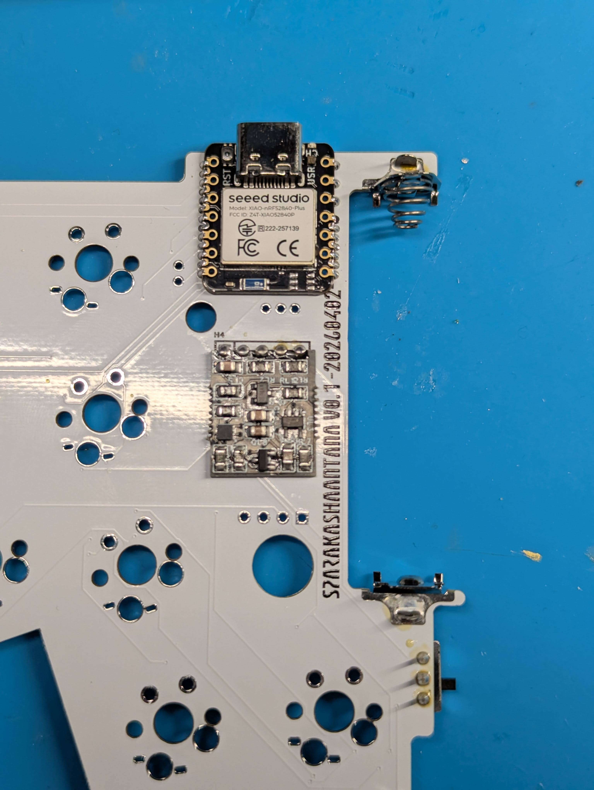
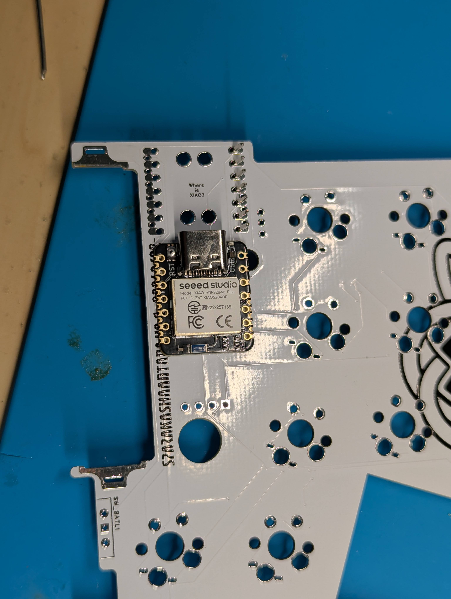

マイコンの背面パッドはBat+をはんだ付けする。（赤枠内の部分）\
⚠️パッドとスルーホールの両方がはんだ付けされて、導通するようにしてください。

### 電池端子のはんだ付け
電池端子は足を折り曲げる。

底につくようにして、基板と垂直になるようにはんだ付けする。
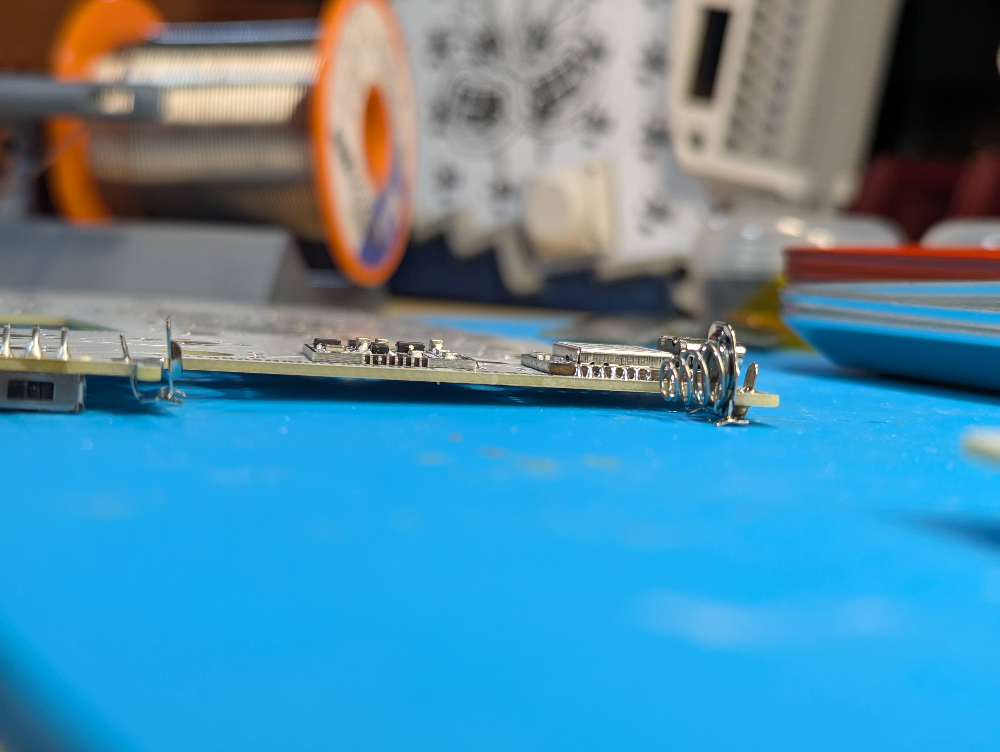

### LEDのはんだ付け
LEDは切り欠きがある部分がGNDです。（赤丸）
PCBのGNDと記載されているパッド（青丸）が重なるように配置します。
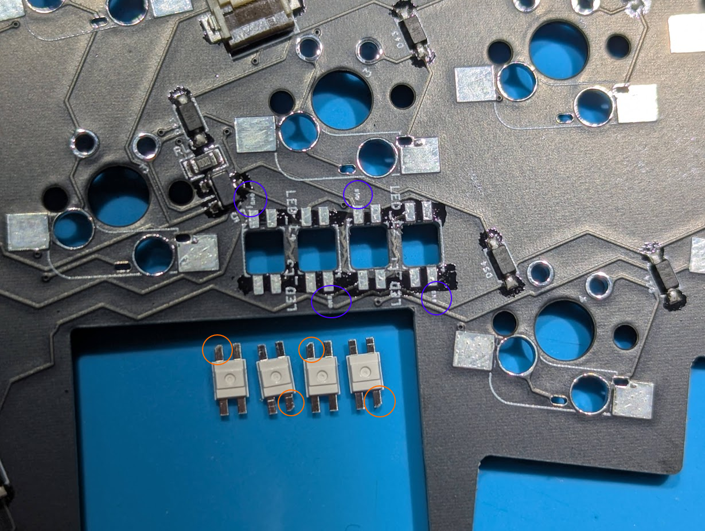

### OLEDのはんだ付け
⚠️IQSモジュールを取り付ける場合は、OLEDは取り付けないこと。
OLEDの裏面にカプトンテープやビニールテープを貼って、ショートしないようにする。
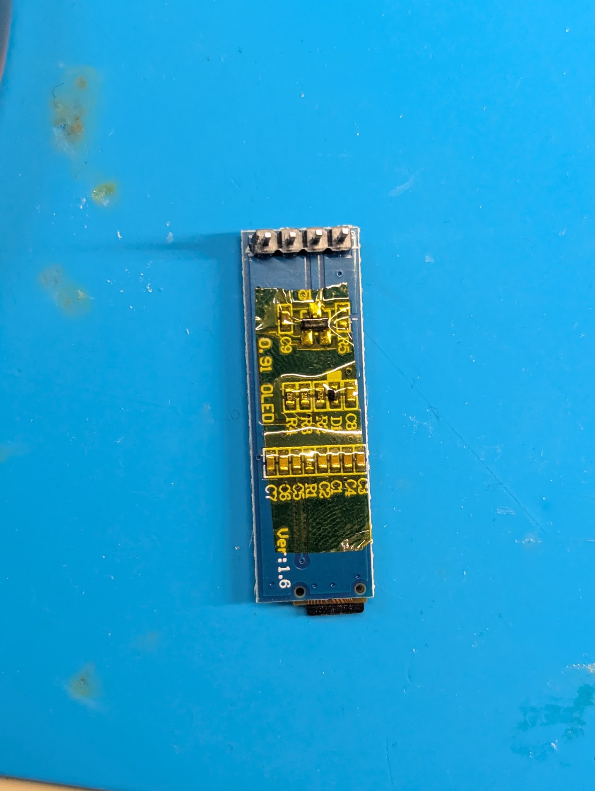

基板と水平になるようにしてはんだ付けする。
⚠️足はなるべく短くなるようにカットすること。
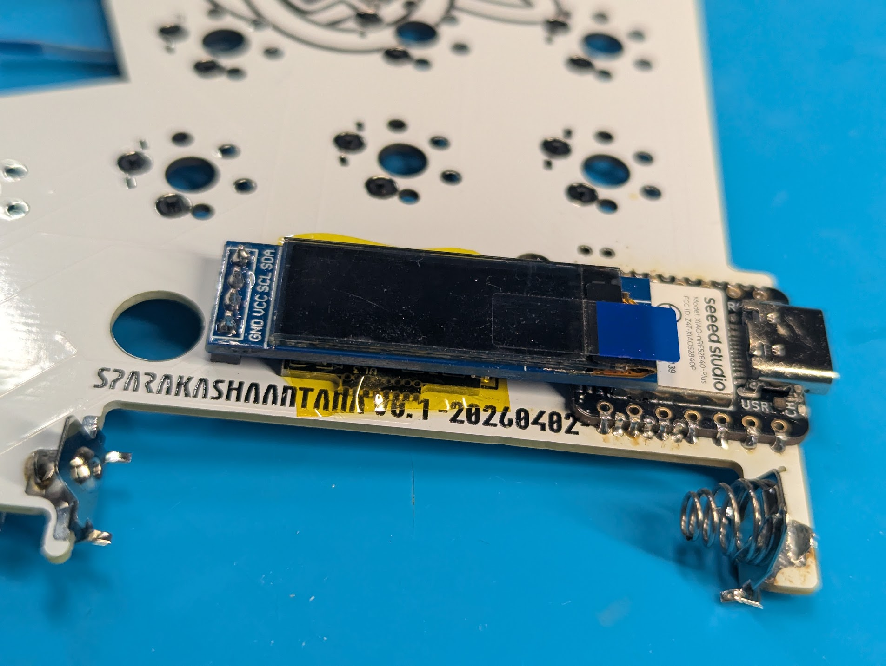

### 方向スイッチのはんだ付け

切り欠きの向きに注意してはんだ付けする。
⚠️本体基板の▲と方向スイッチの切り欠きが一致します。
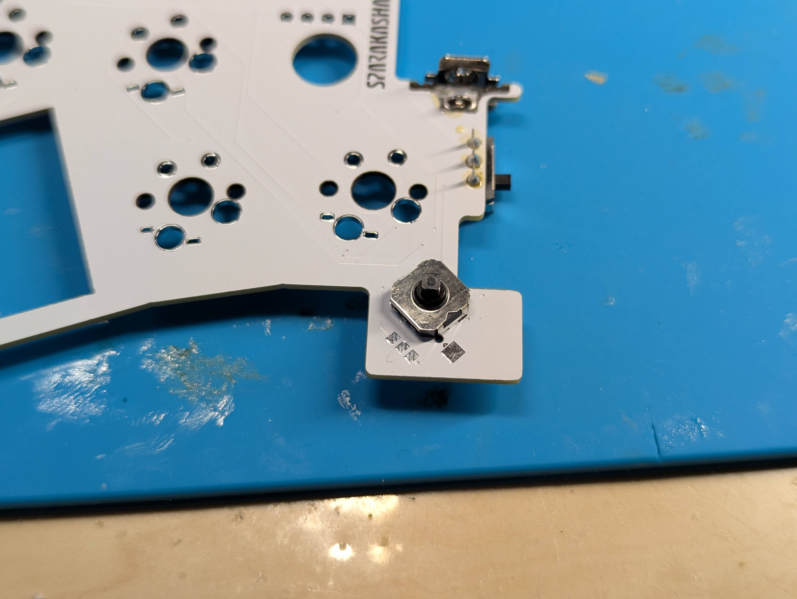

### スライドスイッチのはんだ付け

取り付ける面をよく確認してからはんだ付けする。
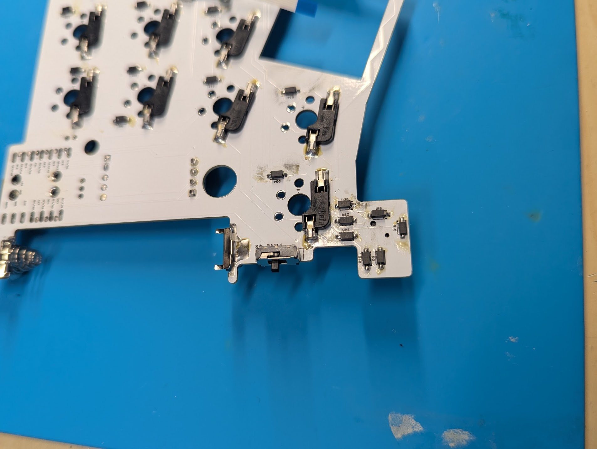
## ケースの組立

### インサートナットの取り付け

内径が小さい方を下にしてインサートナットを穴に置く。
加熱したはんだごてを使用して溶かしながら押し込んでいく。
※こて先が細くインサートナットの穴の中を貫通するものを使用する場合、ボトムケースの底に穴が開く可能性があるので注意。

### モジュールカバーの取り付け

アナログスティックモジュール以外を使用する場合はボトムケースの切欠き部分にカバーを取り付ける。
⚠️向きに注意すること。

### モジュールの取り付け

モジュールの組立については以下を参照すること。

[MeKaBuモジュール組み立てガイド](https://modulable-keyboard-developer.github.io/guides/04module/)

モジュールにFFCケーブルを取り付ける。

ボトムケースにモジュールハウジングがしっかりはまり込むように取り付ける。

### 電源スイッチの仮固定
写真の向きで取り付ける。
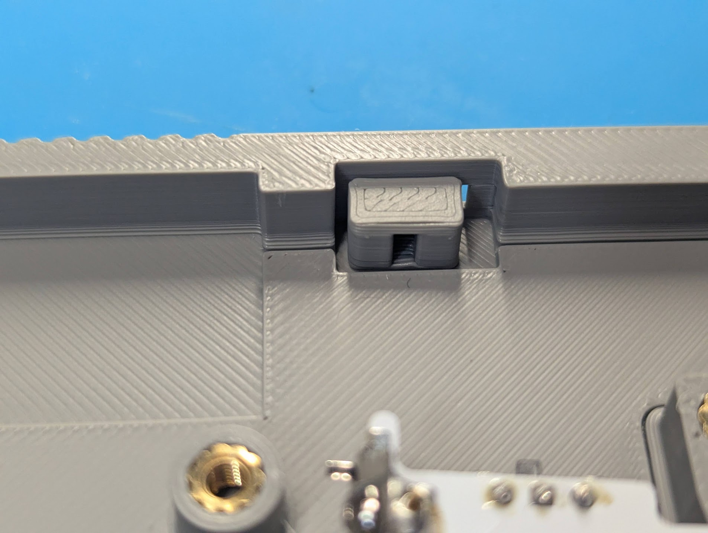
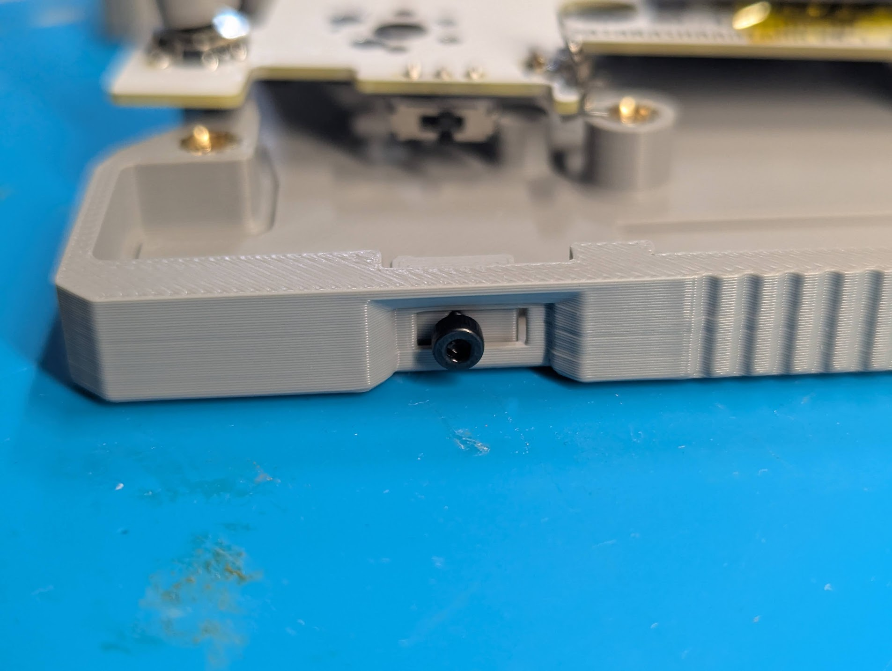

### リセットボタン、透明プラ棒の仮固定
透明プラ棒は差し込む。
リセットボタンの向きに注意してケースに差し込む。
マスキングテープなどでリセットボタンが飛んでいかないように貼り付ける。
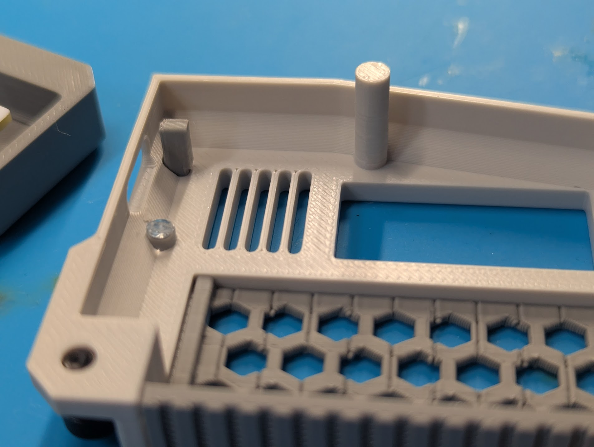

## 全体組立

### ケース組立
バッテリーカバーは折り曲げる方向に力がかかると破損しやすいので注意。
ケースをねじ止めする。

## ファームウェアの選択と書き込み

[設定リポジトリ](https://github.com/te9no/zmk-config-SparAkashaAnanta)の配布案内に従って、左右それぞれのモジュールに合うUF2を用意します。

| モジュール | 左の成果物名 | 右の成果物名 |
| --- | --- | --- |
| トラックボール | `SAA_L_MODULE_TB` | `SAA_R_MODULE_TB` |
| エンコーダ | `SAA_L_MODULE_ENC` | `SAA_R_MODULE_ENC` |
| アナログスティック＆エンコーダ | `SAA_L_MODULE_JOY` | `SAA_R_MODULE_JOY` |
| トラックパッド | `SAA_L_MODULE_TPD` | `SAA_R_MODULE_TPD` |
| 1uKey | `SAA_L_MODULE_KEY` | `SAA_R_MODULE_KEY` |

2026年8月30日に[build.yaml](https://github.com/te9no/zmk-config-SparAkashaAnanta/blob/HEAD/build.yaml)で確認した成果物名（artifact-name）です。表にない構成は似た名称から推測せず、対応するビルドを配布元に確認してください。

書き込み手順は[ファームウェア取り扱いガイド](../90firmwareguide/)を参照してください。書き込み後は、すべてのキーと搭載モジュールの動作を確認します。
