## 🚀 はじめに
このビルドガイドではCornixLPトラックパッドモジュールの組み立て手順を説明します。

## 📋 目次
1. [部品の確認](#部品確認)
2. [組み立て手順](#組み立て手順)
3. [ファームウェアの書き込み](#ファームウェアの書き込み)
4. [キーボードの使い方](#キーボードの使い方)

## 📦 部品確認
### 📥 付属品
|名前|数|備考|
|:-|:-|:-|
|メインPCB|x1| |
|Seeed Studio XIAO nRF52840|x1||
|昇圧基板|x1||
|スライドスイッチ|x1||
|ピンヘッダー|x1|5ピンのみ使用します|
|電池端子|x1|＋、－それぞれ一つずつ|
|FFCケーブル|x1| |
|トラックパッド基板|x1| |
|メインハウジング|x1| |
|トラックパッドカバー|x1||
|トップカバー|x1||
|マイコンカバー|x1| |
|バッテリーカバー|x1| |

### 🛒 別途用意するもの
|名前|数|備考|
|:-|:-|:-|
|カプトンテープやビニールテープ|適当|絶縁に使用します|

### 🛠️ 必要な工具
|工具名|用途|備考|
|:-|:-|:-|
|はんだごて|はんだ付け作業|温度調節機能付きを推奨|
|はんだ|各種実装|Pb含有はんだ 0.8mm程度|
|ニッパー|リード線カット用| |
|精密ドライバー|ネジ止め用|M2、M3用|
|ピンセット|部品の取り扱い用| |

## 🔧 組み立て手順

### 💻 マイコンの実装
写真の通りにマイコンをハンダ付けする。  
外側のスルーホールでは無い側は、側面からはんだを当てて、マイコンのスルーホールにハンダが上がってくることを確認するようにすると良いです。  
（スルーホールの上からハンダを流し込むと、パッドとハンダ付けできているかわかりづらいため）  
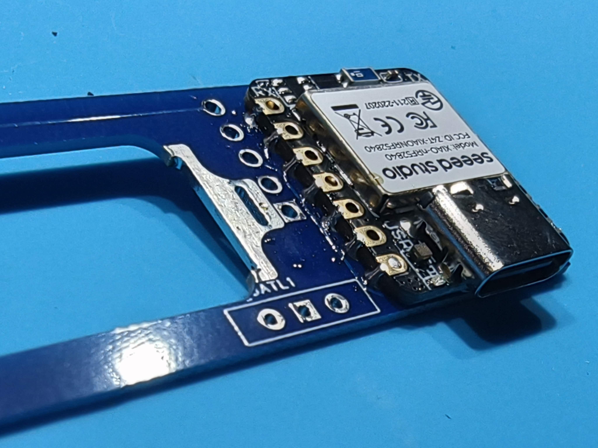  
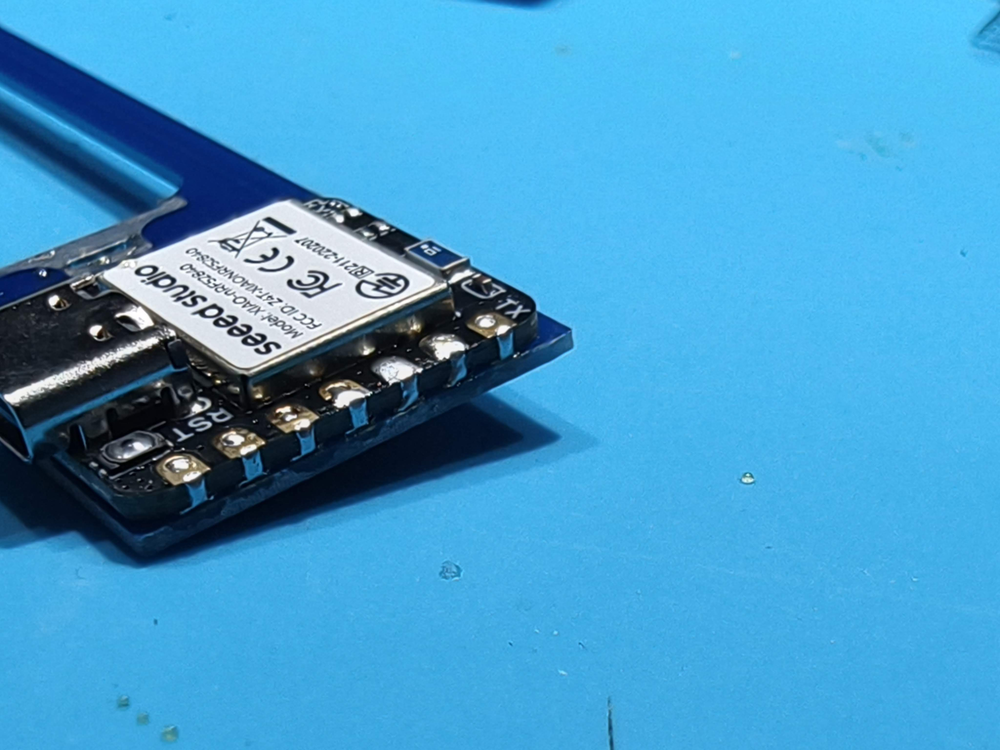  

### ⚡ 昇圧基板の実装
5ピンのピンヘッダーをハンダ付けする。
FFCコネクタの面は余分なピンをカットする。
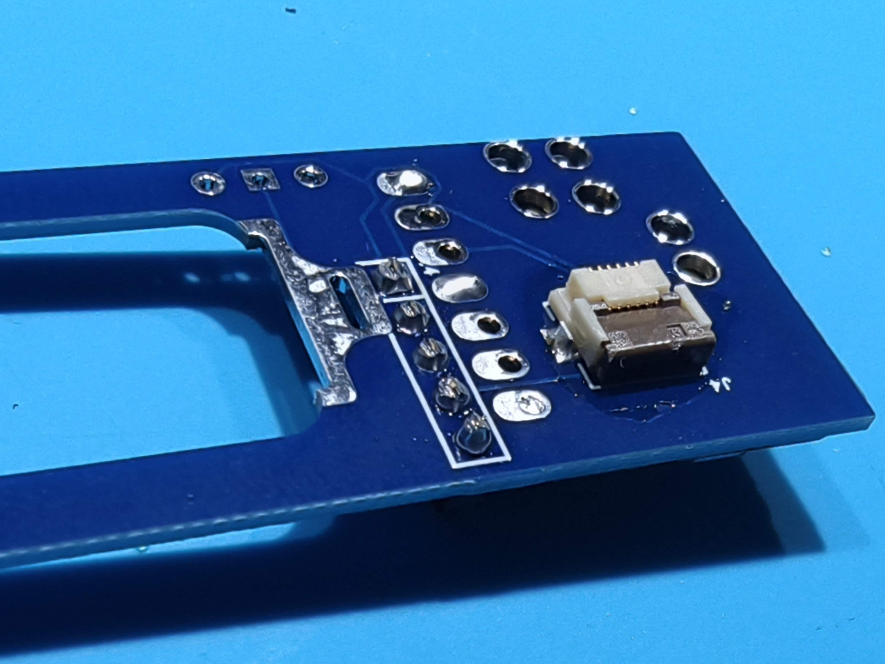  

こんな感じになります。
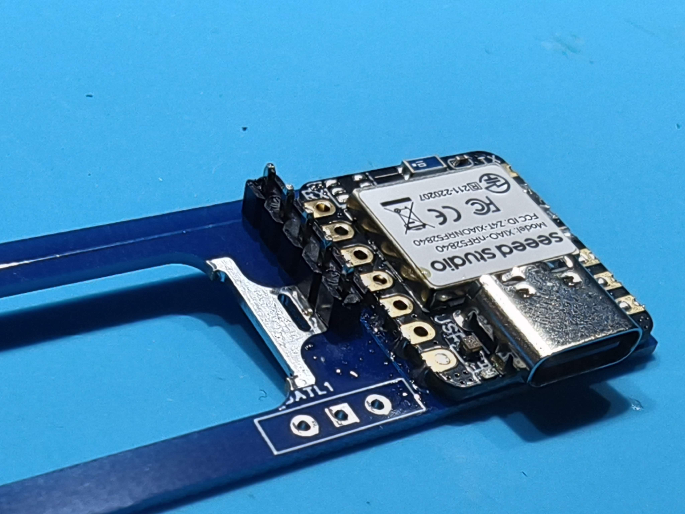  

昇圧基板をハンダ付けします。
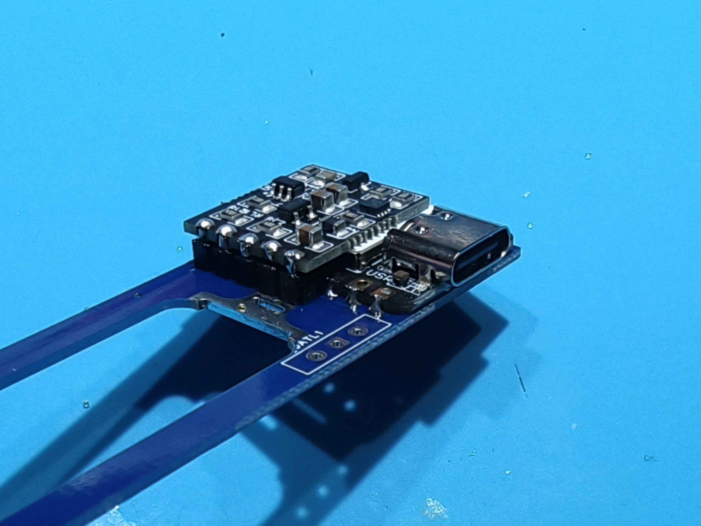  

### 🔋 電池端子の実装
写真の通りに電池端子をハンダ付けする。
電池端子は昇圧基板の高さで固定されるようにする。
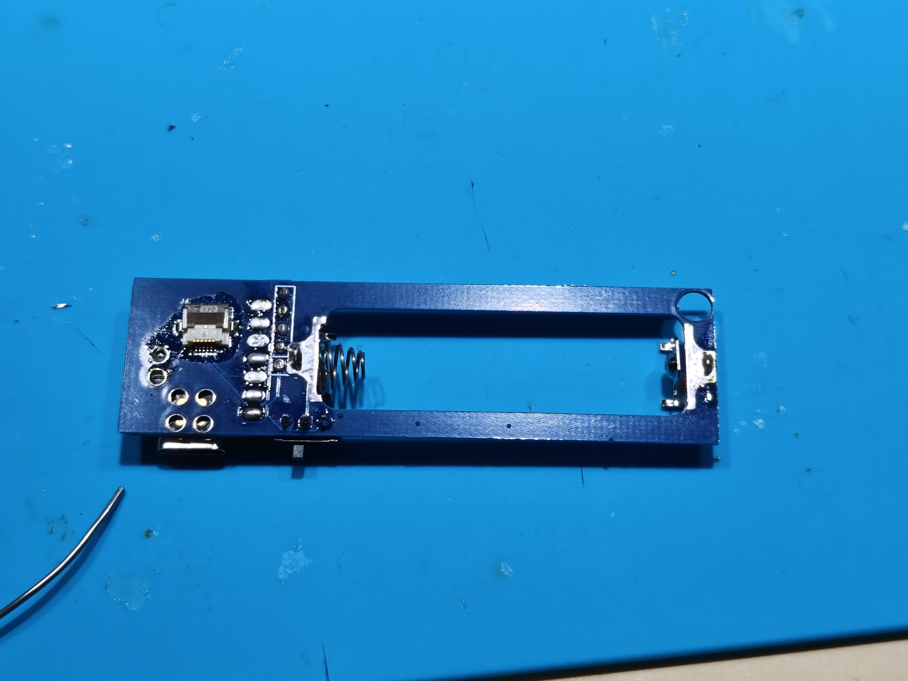  
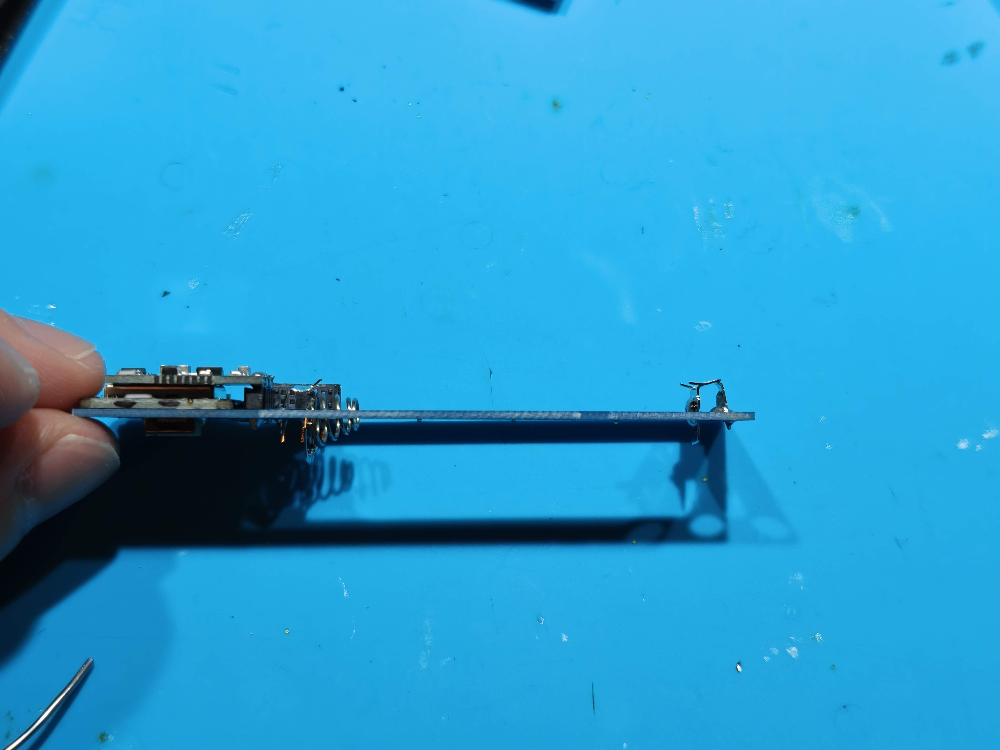  

### 🖱️ トラックパッド基板の接続
メイン基板とFFCケーブルで接続する。
トラックパッド基板側のFFCコネクタはスライドして開放、押し込んで固定する。
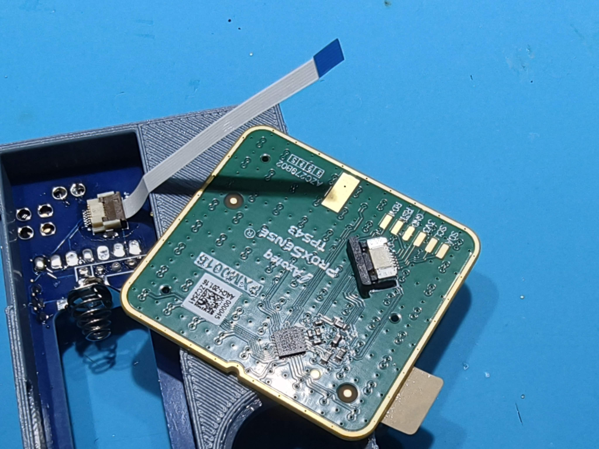  
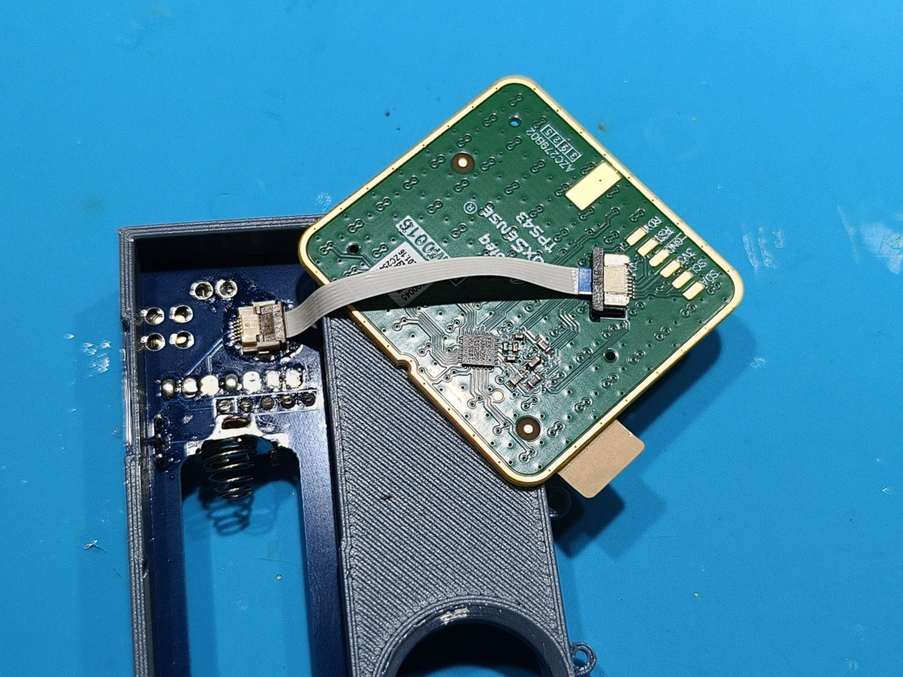  

### 🖱️ ケースへの組み込み
FFCケーブルは折り目が付かないように収める。
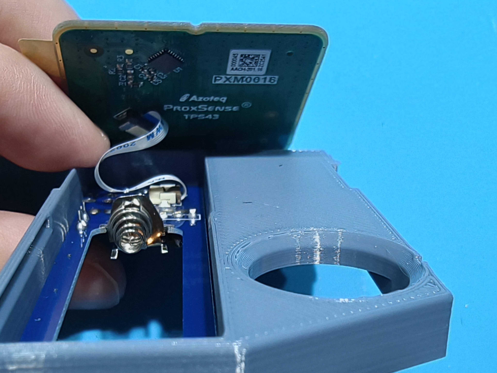  

トラックパッドカバーにはめ込む。
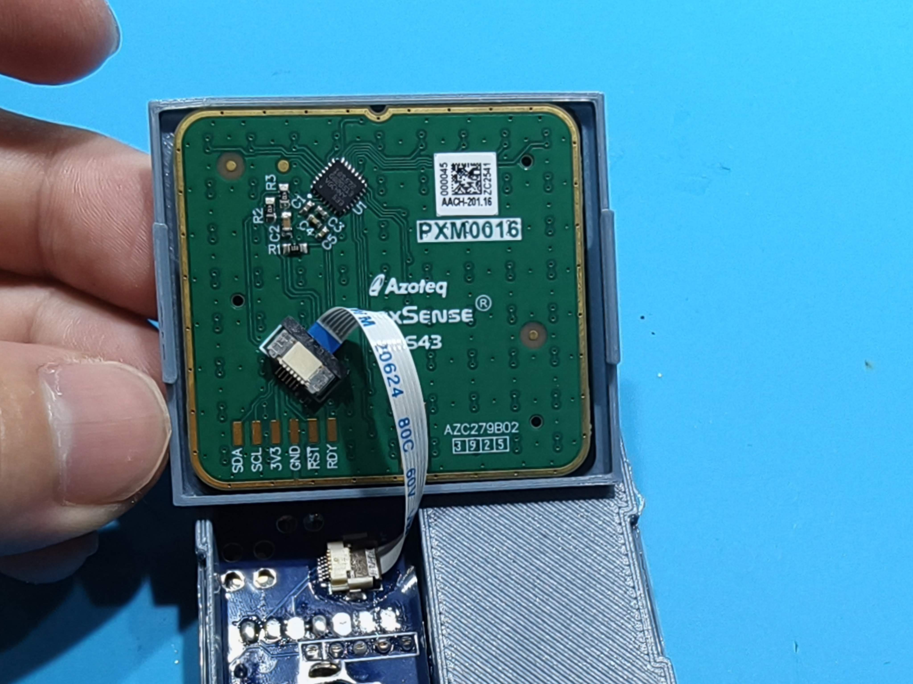  

メインハウジングにトップカバーと一緒に上からはめ込んで取り付ける。
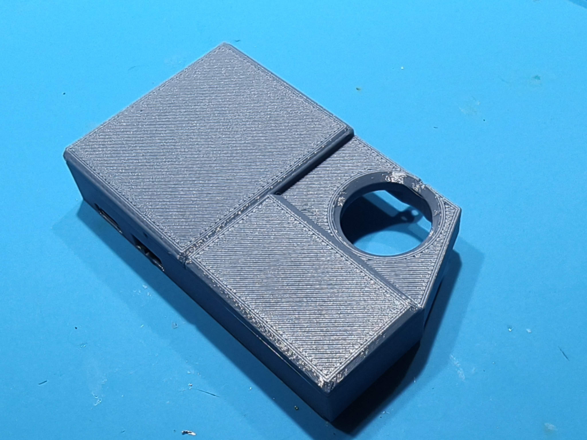  

マイコンカバーとバッテリーカバーを取り付ける。バッテリーカバーはスライドして取り付ける。
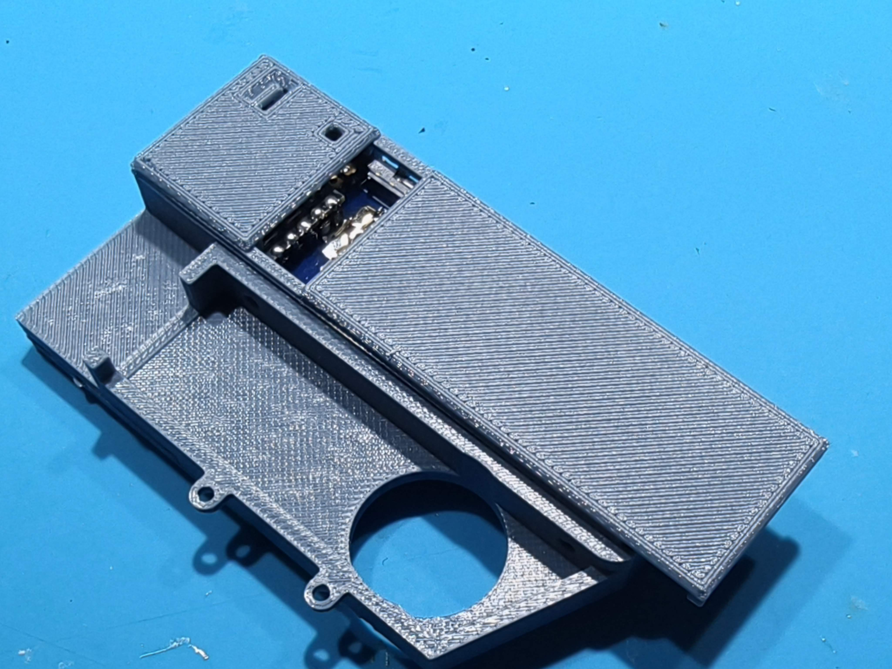  

### 🔋 バッテリーについて
マイコン側が電池のマイナス端子（平たい方）です。  
電源スイッチは左側（マイコン寄り）がOFFです。

### 🍦 ファームウェアについて
以下で開発中です。  
https://github.com/te9no/zmk-keyboard-cornix  
トラックパッドモジュールがCentral、左右CornixがPeripheralになります。