## 購入前チェック

| 確認項目 | この製品で必要なもの・注意点 |
| --- | --- |
| スイッチ・キーキャップ | MX互換スイッチ ×40、MX用ソケット ×40、レイアウトに合うキーキャップ ×40を別途用意 |
| トラックボール | 25mmボール ×1を別途用意 |
| 電源 | 無線化する場合は3.7V LiPoバッテリー ×1（502030想定）を別途用意 |
| 基板の修正 | 修正配線を引っ張らない。修正済みかどうかを確認し、不明な場合はパターンカットなどの追加加工を行わない |

## 作業を始める前に

1. 注文したキットの構成と部品表を照合します。実装済みの部品へのはんだ付けは不要です。
2. はんだ付けや配線・FFCケーブルの抜き差しは、USBと電池を外して行います。電源スイッチをOFFにするだけでは作業しないでください。
3. 部品の取り付け面・向き・極性を、基板の印字と各手順の写真で確認します。写真と手元の基板が異なる場合は加工せず、基板の版とキット内容を確認してください。
4. 通電前に、はんだのブリッジ、切り残したリード線、ケーブルの挟み込みがないか確認します。

書き込み方法と接続トラブルの切り分けは、[ファームウェア取り扱いガイド](../90firmwareguide/)を参照してください。

## 部品確認
### 付属品
|名前|数|備考|
|:-|:-|:-|
|メインPCB|×1| |
|Seeed Studio XIAO nRF52840|×1|メインPCBに取付済み|
|PMW3610用PCB|×1|メインPCBに取付済み|
|L字ピンヘッダー|×1|メインPCBに取付済み|
|バッテリー用ケーブル|×1|※無線化する場合のみ|
|スイッチプレート|×1| |
|ケース（左）|×1| |
|ケース（右）|×1| |
|リセットスイッチボタン|×1| |
|電源スイッチボタン|×1| |
|トラックボールケース|×1| |
|2mmセラミックボール|×3|トラックボールケースに圧入済み|
|OLED|×1|メインPCBに取付済み|
|アナログスティック|×1|メインPCBに取付済み|
|M3 × 5mmネジ|×8| |
|M2 × 8mmネジ|×2| |

### 別途用意するもの
|名前|数|備考|
|:-|:-|:-|
|25mmボール|×1| |
|MX互換キースイッチ|×40| |
|MX用キーソケット|×40| |
|MX型十字ステム対応キーキャップ|×40|レイアウトに合うもの|
|LiPoバッテリー（3.7V、502030想定）|×1|※無線化する場合のみ|
|両面テープ|×1| |

⚠️ LiPoバッテリーは極性を確認し、短絡・過充電・過放電を避けてください。膨張、異臭、異常な発熱がある場合は使用しないでください。

## PCBの修正について
製造ミスにより修正している箇所があります。以下は修正箇所の確認用です。修正済みの基板に追加のパターンカットや配線を行わないでください。修正の有無が分からない場合は、基板の写真と版を販売者へ確認してください。\
はんだが外れる可能性があるため、導線を引っ張ったり、曲げたりしないように注意してください。\
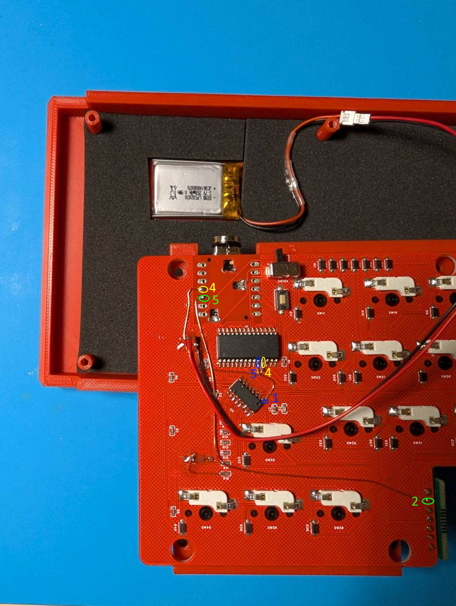

### 修正箇所
#### ①OLEDのSCL
修正対象は黄色枠の部分です（黒線で示した2か所がパターンカット箇所）。手元の基板で作業が必要かどうかは、修正済みの状態と照合してください。
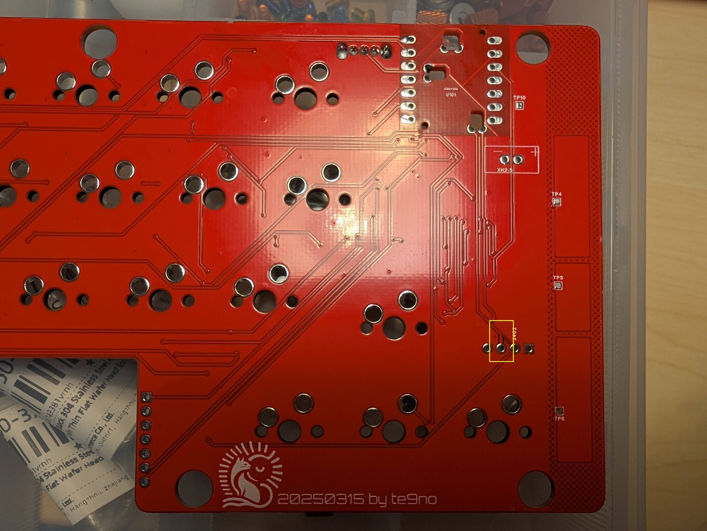
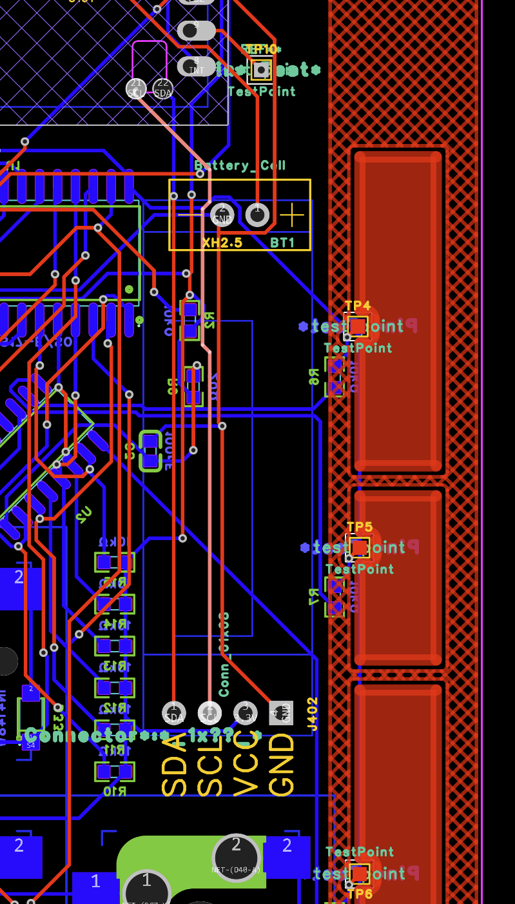

#### ②MCP23S17のCS
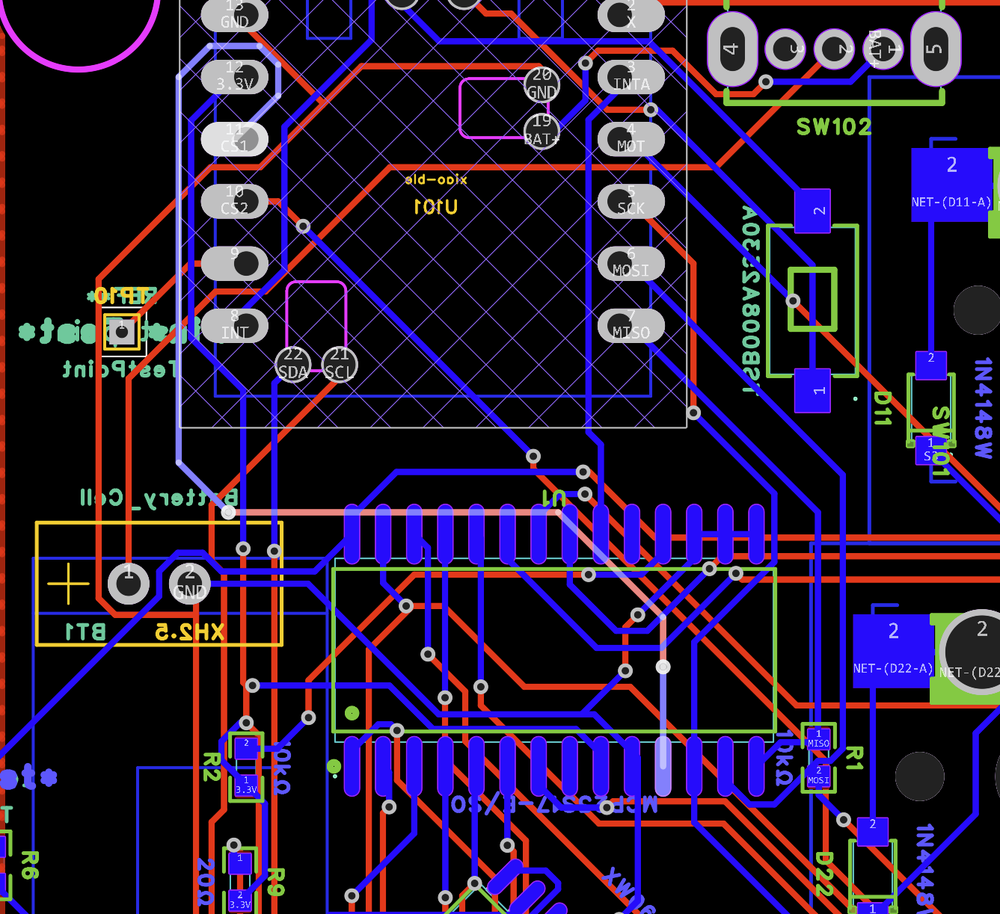

#### ③XW06AのGND
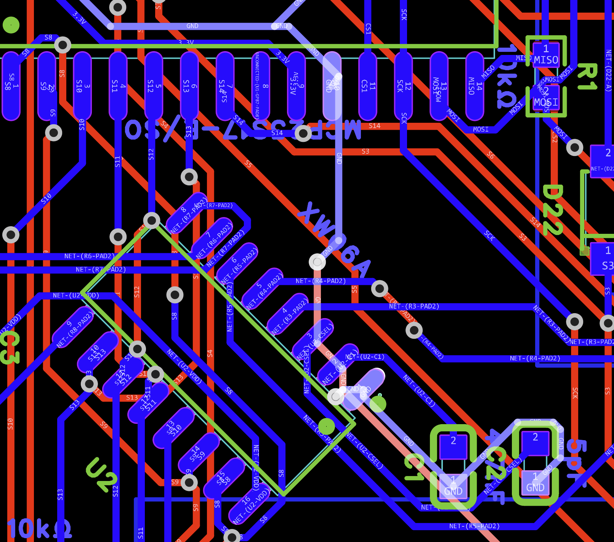

#### ④PMW3610のCS
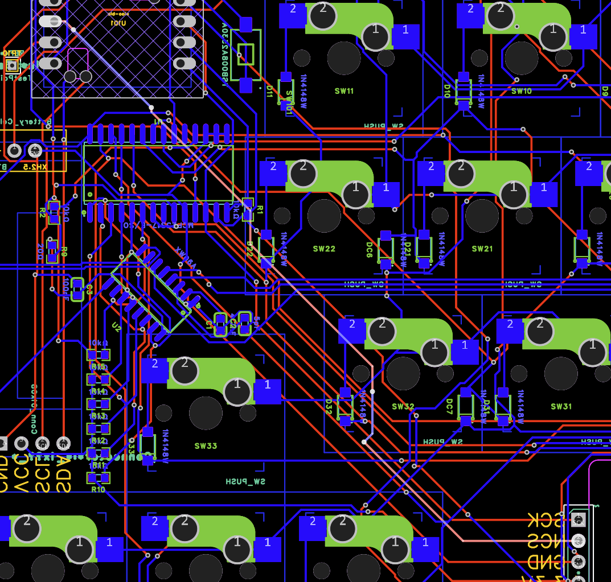

## スイッチソケットの実装
ソケットをはんだ付けする。  

## バッテリーケーブルの実装

無線化する場合のみ行います。
メイン基板を裏向きにして、バッテリーのパッドに＋－を間違えないようにしてケーブルを差し込む。  
※右が-（GND、黒）、左が+（VCC、赤）  
表からはんだ付けする。  
※OLEDの下に端子が隠れています。はんだ付けしづらいので注意。  
はんだ付け後、裏面に伸びたリード線はショートしないようにカットする。  
バッテリーケーブルはテープや接着剤でPCBに固定することを推奨。  
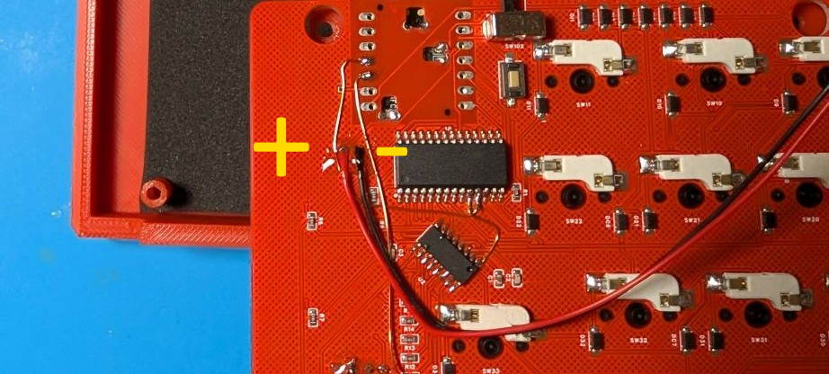

Tips：ぶらぶらしたケーブルがPCBのネジ穴とケースの固定用突起に挟まったままPCBを挿入したことで、ケーブルが切断されたことがあるので注意。   

## バッテリーの実装

無線化する場合のみ行います。
ケース左上の空間にバッテリーを両面テープなどで固定する。  
この段階ではバッテリーを接続しません。すべてのはんだ付け・FFCケーブル接続と配線の点検を終えてから、バッテリーを接続してください。線の色だけで判断せず、基板の＋／－表示とバッテリーの仕様で極性を確認します。\

## アナログスティックの実装
FFCコネクタの爪を持ち上げて開放状態にする。  
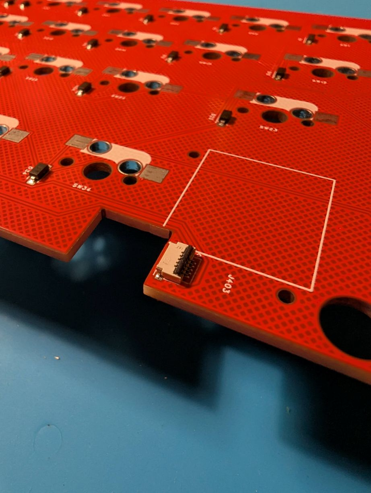

FFCケーブルの向きに注意して、コネクタに差し込む。    
※写真の向きで正常です。
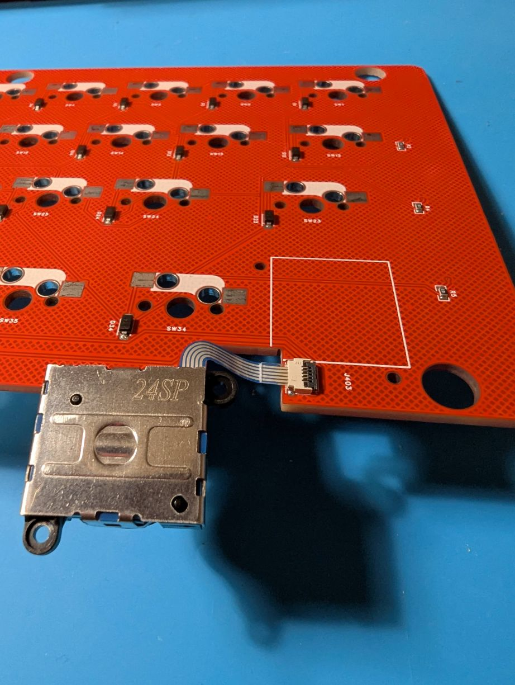

FFCコネクタの爪を下げてロック状態にする。 
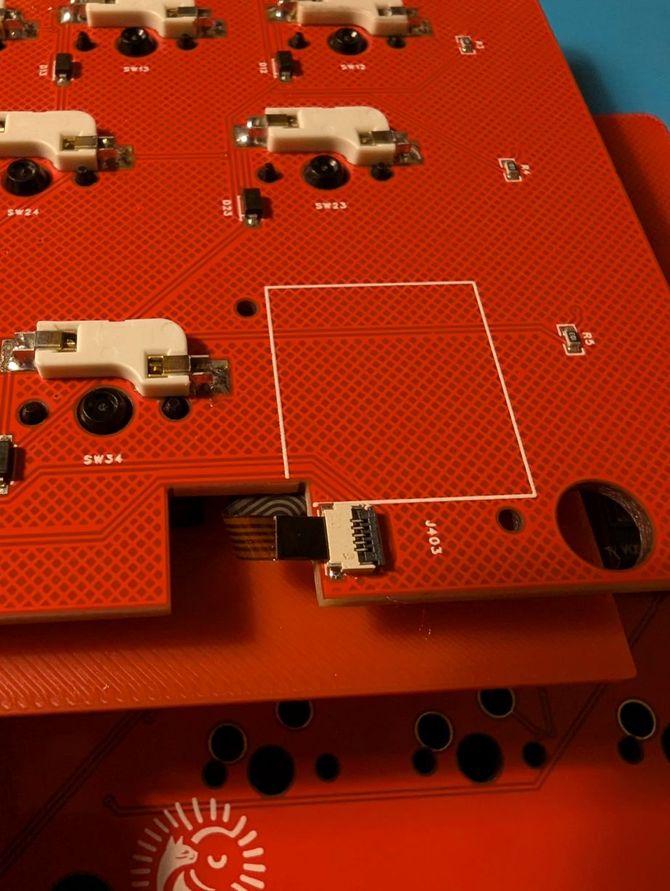

FFCコネクタに力がかからないよう支えながら、接続したアナログスティックを写真の位置へ移動します。ケーブルを鋭く折り曲げたり、コネクタ本体をねじったりしないでください。
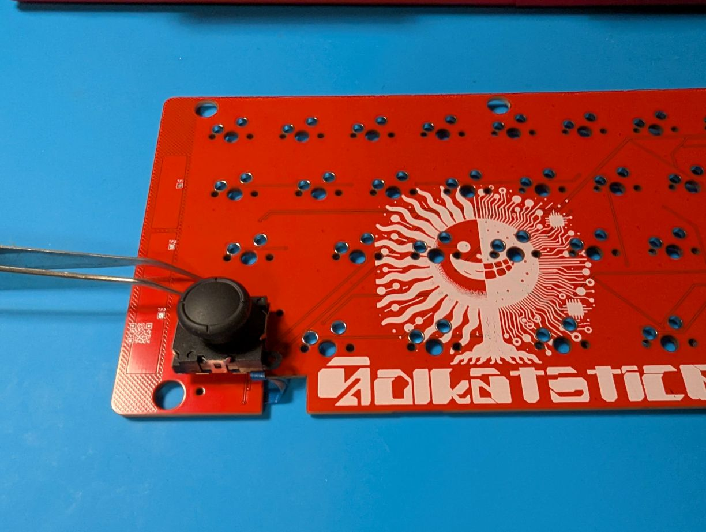

## スイッチプレートの組み立て
スイッチプレートとメインPCBを重ねてスイッチを挿していく。  

## ケースの組み立て
ケースを組み合わせる。  
電源スイッチ、リセットスイッチをケース内側から差し込む。（吹き飛びやすいので注意）  
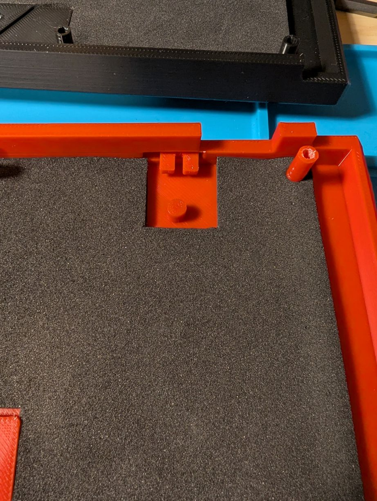
メインPCBをケースに取り付ける。この時、バッテリーケーブルがPCBのネジ穴とケースの固定用突起などに挟まれないように注意すること。  
M3ネジでPCBをケースに固定する。  

ケースは指定のネジや固定部品で組み立ててください。はんだごてによるケースの融着は、変形や分解不能の原因になるため、このガイドでは行いません。

## トラックボールケースの実装
トラックボールケースを差し込み、裏からM2ネジで固定する。  

## ファームウェアの書き込み

先に購入時の配布案内から、この製品用のUF2を用意してください。本サイトでは配布URLと対象ファイル名が未確認のため、不明な場合は販売者へ確認してください。別機種用のファイルは使用しないでください。

USBケーブルでPCに接続する。  
裏面のリセットスイッチを素早く2回クリックするとUSBドライブとしてマウントされる。  
UF2ファイルをドラッグ＆ドロップするとファームウェアの書き込みが始まる。  
再起動後、キーと搭載モジュールが動作することを確認する。ドライブが消えたことだけでは成功と判断しない。\

## レイヤー機能
|#|レイヤー|機能|
|:-|:--|:--|
|0|USレイヤー|デフォルトのレイヤー|
|1|疑似JISレイヤー|tabキー長押しで有効/無効を切り替える。|
|2|Functionレイヤー||
|3|Numberレイヤー|USレイヤーから有効化可能|
|4|疑似JIS Numberレイヤー|疑似JISレイヤーから有効化可能|
|5|マウスレイヤー|トラックボールが動いている間にのみ有効になる。|
|6|スクロールレイヤー|レイヤー2を有効にしている間にのみ有効になる。 トラックボールを動かすとスクロールする。 |
|7|BTレイヤー|数字1~5を押すことで接続プロファイルを切り替える。|

### JISレイヤー機能
・tabキー長押しでレイヤー1（疑似JISレイヤー）を有効/無効を切り替える。  
・レイヤー1は日本語配列として認識しているキーボードで英語配列の入力ができる。  
（例：日本語配列として認識しているPCで、レイヤー1を有効にしてSHIFT+2→＠を入力） 

### マウスレイヤー機能
以下のマウス入力が可能となる。
|キー|機能|
|:-|:-|
|「.」キー|左クリック|
|「/」キー|中央クリック|
|「右SHIFT」キー|右クリック|

### 接続プロファイル切り替え機能
・上のレイヤー表ではBTレイヤーは7です。切り替えキーは使用するファームウェアのキーマップで確認し、BTレイヤーで数字1～5を押して接続プロファイルを選びます。\
・接続情報の消去キーも配布キーマップで確認してください。全プロファイルの消去は、登録済みの接続先すべてに影響します。\

## その他
### 電源スイッチ

電源スイッチは左側でON、右側でOFFとなる。
