# ビルドガイド
## 部品確認
### 付属品
|名前|数|備考|
|:-|:-|:-|
|メインPCB|x1| |
|Seeed Studio XIAO nRF52840|x1|メインPCBに取付済み|
|PMW3610用PCB|x1|メインPCBに取付済み|
|L字ピンヘッダー|x1|メインPCBに取付済み|
|バッテリー用ケーブル|x1|※無線化する場合のみ|
|スイッチプレート（左）|x1|付属するのはプレートマウント用|
|スイッチプレート（右）|x1|付属するのはプレートマウント用|
|ケース（左）|x1| |
|ケース（右）|x1| |
|リセットスイッチボタン|x1| |
|トラックボールケース|x1| |
|2mmセラミックボール|x3|トラックボールケースに圧入済み|
|M3x5mmネジ|x8| |
|M2x5mmネジ|x2| |
|細い結束バンド|x1| |
 
### 別途用意するもの
|名前|数|備考|
|:-|:-|:-|
|34mmボール|x1| |
|2Uプレートマウントスタビライザー|x4| |
|Cherry MXキースイッチ|x62| |
|Cherry MXキーソケット|x62| |
|キーキャップ（日本語配列 or 英語配列）| | |
|3.7V電池（Lipoバッテリー902540想定）|x1|※無線化する場合のみ ※もう少し小さいものでも十分ですが、厚さ9mm以下にして下さい。|
|両面テープ|x1| |
 
## スイッチソケット（PCBマウントスタビライザー）の実装
ソケットは日本語配列と英語配列で使用するキーに注意しながらはんだ付けする。  
PCBマウントスタビライザーを使用する場合はここで実装する。  

## バッテリーケーブルの実装
メイン基板を裏向きにして、バッテリーのパッドに＋－を間違えないようにしてケーブルを差し込む。  
※上が-（GND、黒）、下が+（VCC、赤）  
表からはんだ付けする。  
はんだ付け後、裏面に伸びたリード線はショートしないようにカットする。  
バッテリーケーブルはテープや接着剤でPCBに固定することを推奨。  
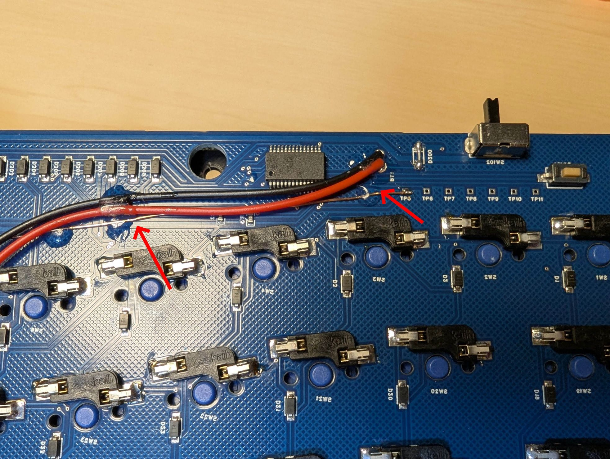

Tips：ぶらぶらしたケーブルがPCBのネジ穴とケースの固定用突起に挟まったままPCBを挿入したことで、ケーブルが切断されたことがあるので注意。   

## バッテリーの実装
ケース左上の空間にバッテリーを両面テープなどで固定する。  
バッテリーケーブルとバッテリーを接続する。（赤線と赤線、黒線と黒線がつながるようにすること。）  
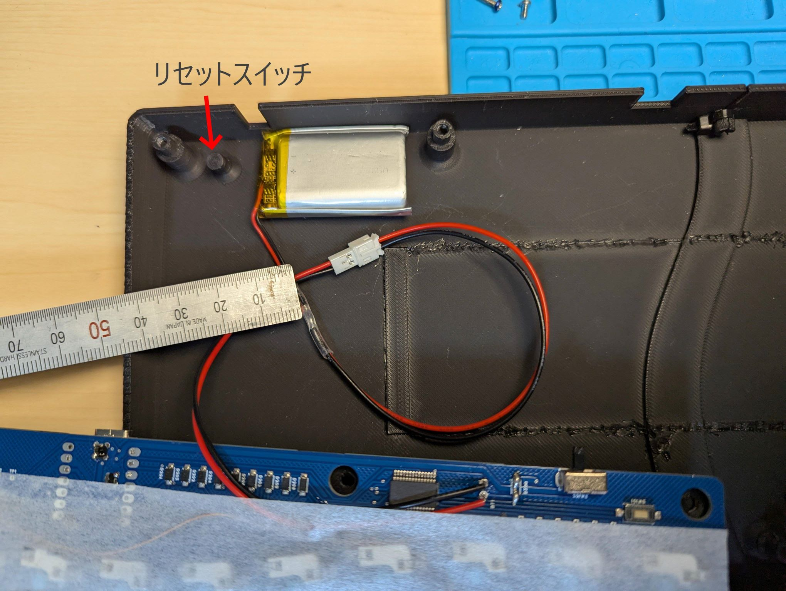
 
## スイッチプレートの組み立て
プレートマウントスタビライザーを使用する場合は、スイッチプレートにスタビライザーを実装する。  
スイッチプレートとメインPCBを重ねてスイッチを挿していく。  
 
## ケースの組み立て
ケースを組み合わせる。  
ケース内側の結合用突起に結束バンドを付けて固定する。  
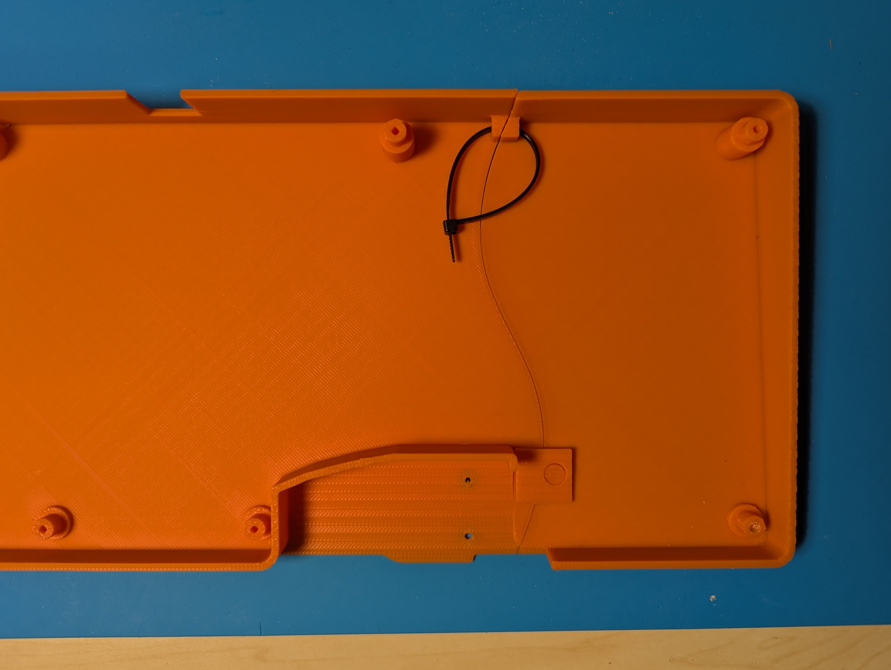
リセットスイッチをケース内側から差し込む。（吹き飛びやすいので注意）  
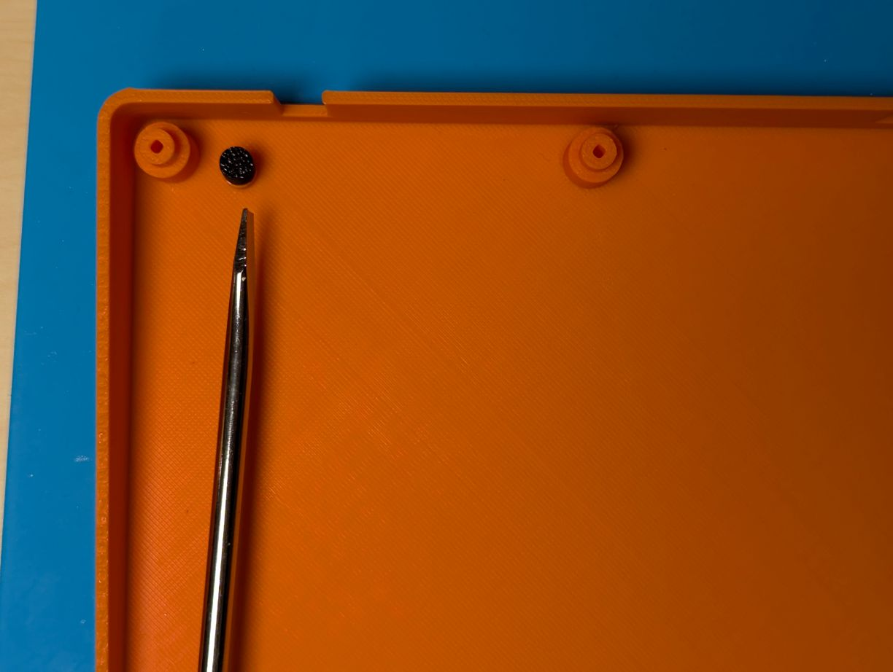
メインPCBをケースに取り付ける。この時、バッテリーケーブルがPCBのネジ穴とケースの固定用突起などに挟まれないように注意すること。  
M3ネジでPCBをケースに固定する。  

Tips：ケースを組み合わせてから、230度くらいのハンダゴテでケースの繋ぎ目を裏からなぞって融着させることで、強度を上げることができるかもしれません。 
 
## トラックボールケースの実装
トラックボールケースを差し込み、裏からM2ネジで固定する。  
 
## ファームウェアの書き込み
USBケーブルでPCに接続する。  
裏面のリセットスイッチを素早く2回クリックするとUSBドライブとしてマウントされる。  
UF2ファイルをドラッグ＆ドロップするとファームウェアの書き込みが始まる。  
完了すると自動的に切断され、使用できる状態となる。  
 
## レイヤー機能
|#|レイヤー|機能|
|:-|:--|:--|
|0|USレイヤー|デフォルトのレイヤー|
|1|疑似JISレイヤー|tabキー長押しで有効/無効を切り替える。|
|2|Functionレイヤー|
|3|マウスレイヤー|トラックボールが動いている間にのみ有効になる。|
|4|スクロールレイヤー|レイヤー2を有効にしている間にのみ有効になる。 トラックボールを動かすとスクロールする。 |
|5|BTレイヤー|数字1~5を押すことで接続プロファイルを切り替える。|

### JISレイヤー機能
・tabキー長押しでレイヤー1（疑似JISレイヤー）を有効/無効を切り替える。  
・レイヤー1は日本語配列として認識しているキーボードで英語配列の入力ができる。  
（例：日本語配列として認識しているPCで、レイヤー1を有効にしてSHIFT+2→＠を入力） 

### マウスレイヤー機能
以下のマウス入力が可能となる。
|キー|機能|
|:-|:-|
|「.」キー|左クリック|
|「/」キー|中央クリック|
|「右SHIFT」キー|右クリック|

### 接続プロファイル切り替え機能
・「＼」キーを押している間レイヤー5が有効になり、同時に数字1~5を押すことで接続プロファイルを切り替える。  
・レイヤー5で「`」キー→現在の接続プロファイルを消去する。tabキー→接続プロファイルを全て消去する。  

## キーの編集（ZMK Studio）
### ZMK Studioの起動
Web版　https://zmk.studio/ ※USB接続のみ対応  
アプリ版　https://zmk.studio/download ※USB接続、無線接続対応  
起動すると以下のような画面が表示される。接続するキーボード名をクリックする。  
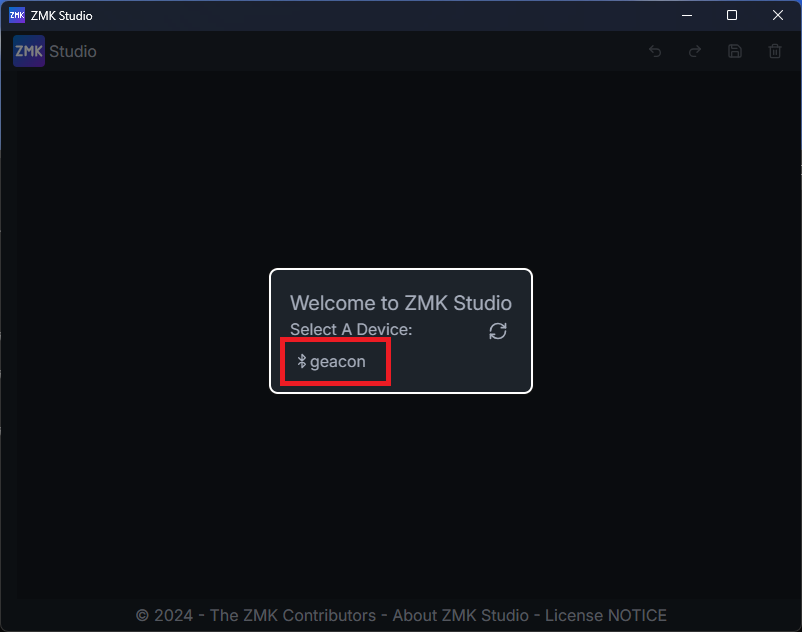  

### キーの編集
左ペインでレイヤーを選択  
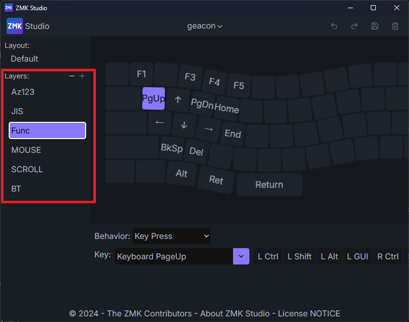  

変更したいキーを選択し、下部に表示されるKeyから設定したいキーを選択する。  
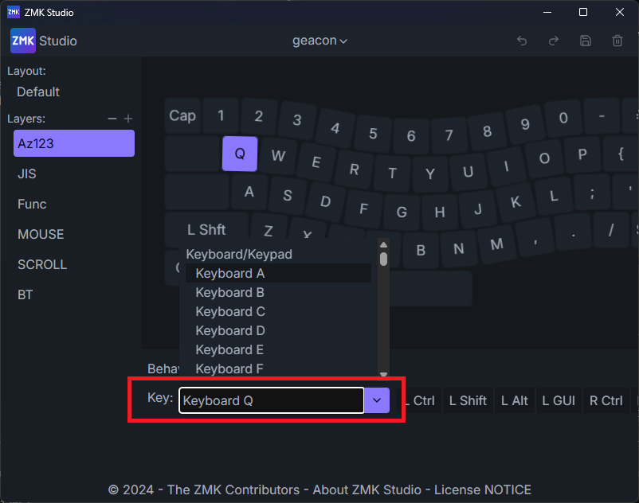  

変更を反映するには右上の保存ボタンをクリックする。  
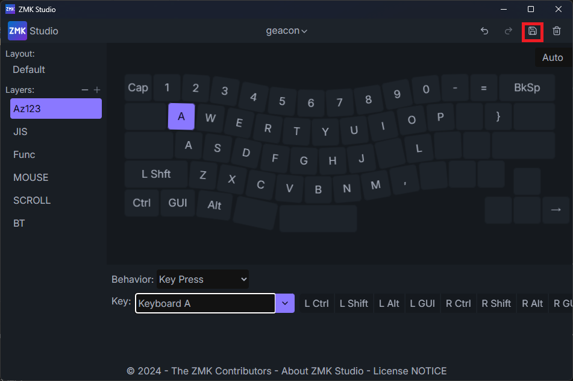  

### キーの編集（Keymap Editor）
以下リポジトリをクローンして、ローカルにチェックアウトしておく。  
https://github.com/te9no/zmk-config-te9no  
  
Keymap Editorのページを開く。  
https://nickcoutsos.github.io/keymap-editor/  

File Systemを選択する。  
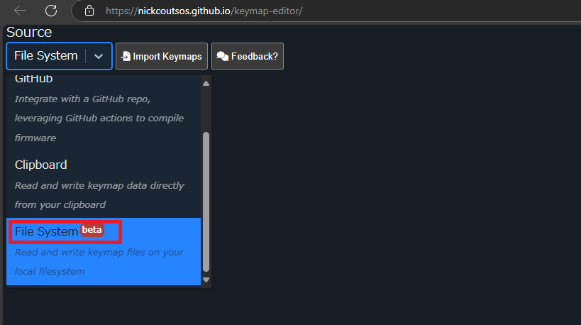  

Import Keymapsをクリックする。  
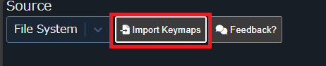  

.keymapファイルを選択する。  
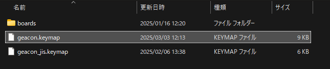  

Identify Keyboardをクリックする。  
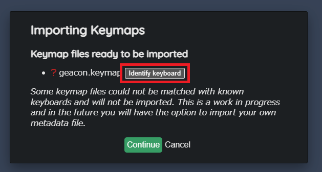  

Custom...を選択する。  
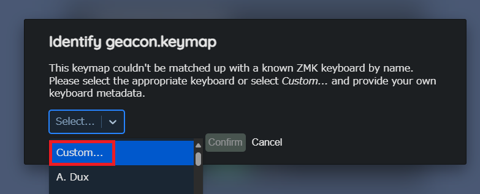  

ファイルの選択をクリックする。  
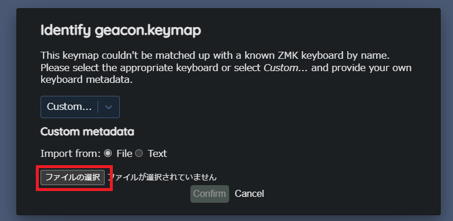  

.jsonファイルを選択する。  
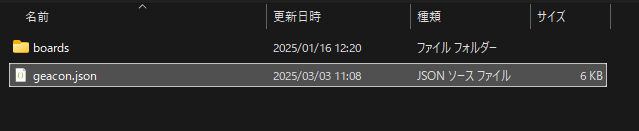  

Confirmをクリックする。  
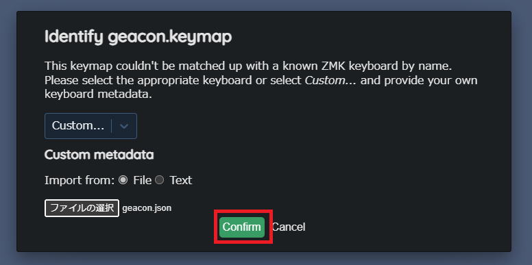  

Continueをクリックする。  
  

適当に編集してSaveボタンをクリックすると、ローカルのファイルに変更が反映される。  
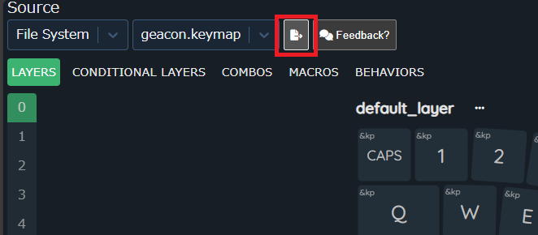  

Githubのリポジトリに変更をプッシュする。  

Github Actionでコミットごとにビルドされる。Artifactsからビルドされたファームウェアをダウンロードする。  
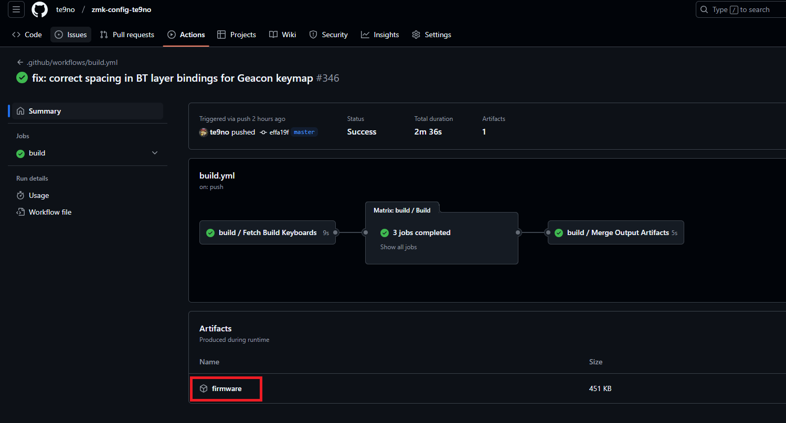

## その他
### 電源スイッチ

電源スイッチは左側でON、右側でOFFとなる。  
 
### PCBの外し方
トラックボールケースを固定しているネジを外す。
トラックボールケースを外す。  
電源スイッチとケースの隙間にマイナスドライバーなどを差し込み、PCBを持ち上げる。  
左端にできたケースとPCBの隙間にカードなどを差し込み、電源スイッチ付近を押し込むと、左下が持ち上がる。  
PCB左側を持ち上げたまま中央部分も持ち上げてケースから外す。  