## 購入前チェック

| 確認項目 | この製品で必要なもの・注意点 |
| --- | --- |
| スイッチ・キーキャップ | MX互換スイッチ ×62、MX用ソケット ×62、選んだ日本語／英語配列に合うキーキャップ ×62を別途用意 |
| スタビライザー | 付属プレートはプレートマウント用。2Uプレートマウントスタビライザー ×4を別途用意 |
| トラックボール | 34mmボール ×1を別途用意 |
| 電源 | 無線化する場合は3.7V LiPoバッテリー ×1（902540想定、厚さ9mm以下）を別途用意 |

## 作業を始める前に

1. 注文したキットの構成と部品表を照合します。実装済みの部品へのはんだ付けは不要です。
2. はんだ付けや配線・FFCケーブルの抜き差しは、USBと電池を外して行います。電源スイッチをOFFにするだけでは作業しないでください。
3. 部品の取り付け面・向き・極性を、基板の印字と各手順の写真で確認します。写真と手元の基板が異なる場合は加工せず、基板の版とキット内容を確認してください。
4. 通電前に、はんだのブリッジ、切り残したリード線、ケーブルの挟み込みがないか確認します。

書き込み方法と接続トラブルの切り分けは、[ファームウェア取り扱いガイド](../90firmwareguide/)を参照してください。

## 部品確認
### 付属品
|名前|数|備考|
|:-|:-|:-|
|メインPCB|×1| |
|Seeed Studio XIAO nRF52840|×1|メインPCBに取付済み|
|PMW3610用PCB|×1|メインPCBに取付済み|
|L字ピンヘッダー|×1|メインPCBに取付済み|
|バッテリー用ケーブル|×1|※無線化する場合のみ|
|スイッチプレート（左）|×1|付属するのはプレートマウント用|
|スイッチプレート（右）|×1|付属するのはプレートマウント用|
|ケース（左）|×1| |
|ケース（右）|×1| |
|リセットスイッチボタン|×1| |
|トラックボールケース|×1| |
|2mmセラミックボール|×3|トラックボールケースに圧入済み|
|M3 × 5mmネジ|×8| |
|M2 × 5mmネジ|×2| |
|細い結束バンド|×1| |
 
### 別途用意するもの
|名前|数|備考|
|:-|:-|:-|
|34mmボール|×1| |
|2Uプレートマウントスタビライザー|×4| |
|MX互換キースイッチ|×62| |
|MX用キーソケット|×62| |
|MX型十字ステム対応キーキャップ|×62|選択した日本語配列または英語配列に合うもの|
|LiPoバッテリー（3.7V、902540想定）|×1|※無線化する場合のみ ※より小さいものも使用できますが、厚さ9mm以下にしてください。|
|両面テープ|×1| |

⚠️ LiPoバッテリーは極性を確認し、短絡・過充電・過放電を避けてください。膨張、異臭、異常な発熱がある場合は使用しないでください。
 
## スイッチソケット（PCBマウントスタビライザー）の実装
ソケットは日本語配列と英語配列で使用するキーに注意しながらはんだ付けする。  
PCBマウントスタビライザーを使用する場合はここで実装する。  

## バッテリーケーブルの実装

無線化する場合のみ行います。
メイン基板を裏向きにして、バッテリーのパッドに＋－を間違えないようにしてケーブルを差し込む。  
※上が-（GND、黒）、下が+（VCC、赤）  
表からはんだ付けする。  
はんだ付け後、裏面に伸びたリード線はショートしないようにカットする。  
バッテリーケーブルはテープや接着剤でPCBに固定することを推奨。  
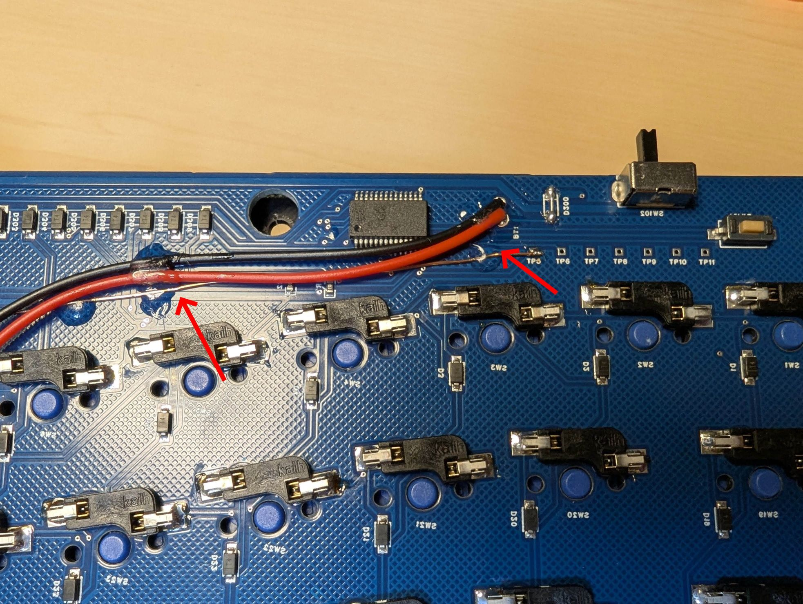

Tips：ぶらぶらしたケーブルがPCBのネジ穴とケースの固定用突起に挟まったままPCBを挿入したことで、ケーブルが切断されたことがあるので注意。   

## バッテリーの実装

無線化する場合のみ行います。
ケース左上の空間にバッテリーを両面テープなどで固定する。  
この段階ではバッテリーを接続しません。すべてのはんだ付け・FFCケーブル接続と配線の点検を終えてから、バッテリーを接続してください。線の色だけで判断せず、基板の＋／－表示とバッテリーの仕様で極性を確認します。\
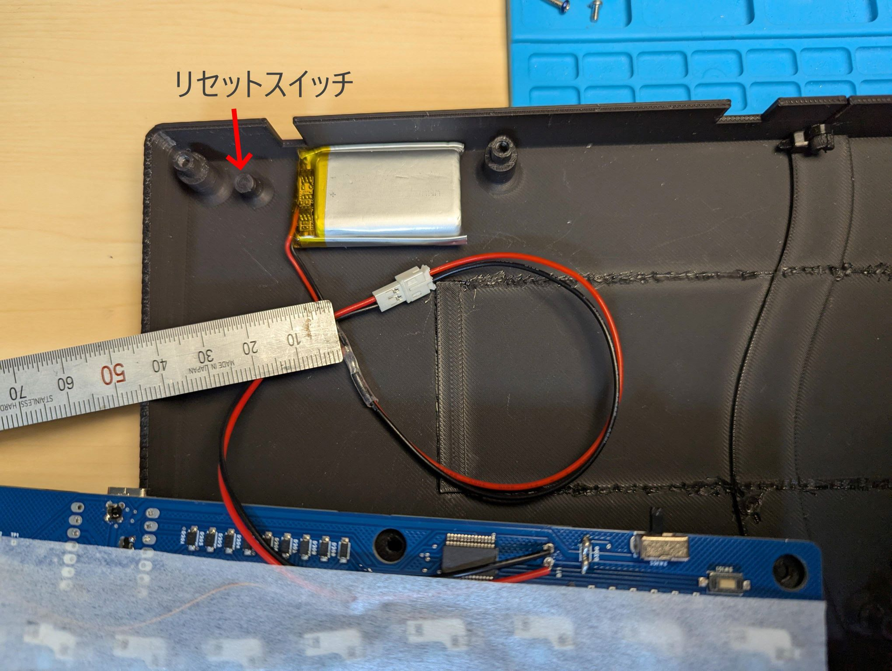
 
## スイッチプレートの組み立て
プレートマウントスタビライザーを使用する場合は、スイッチプレートにスタビライザーを実装する。  
スイッチプレートとメインPCBを重ねてスイッチを挿していく。  
 
## ケースの組み立て
ケースを組み合わせる。  
ケース内側の結合用突起に結束バンドを付けて固定する。  
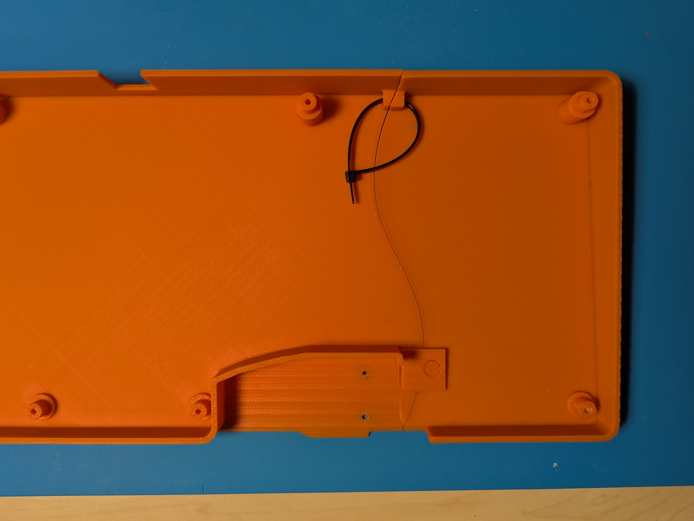
リセットスイッチをケース内側から差し込む。（吹き飛びやすいので注意）  
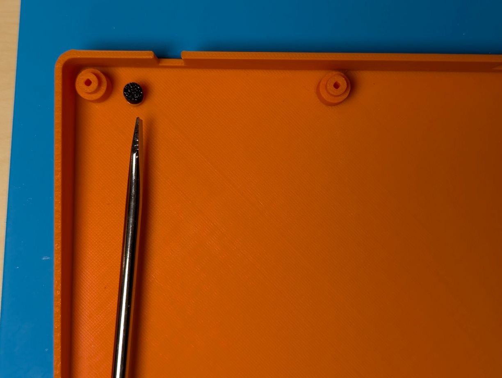
メインPCBをケースに取り付ける。この時、バッテリーケーブルがPCBのネジ穴とケースの固定用突起などに挟まれないように注意すること。  
M3ネジでPCBをケースに固定する。  

ケースは指定のネジや固定部品で組み立ててください。はんだごてによるケースの融着は、変形や分解不能の原因になるため、このガイドでは行いません。
 
## トラックボールケースの実装
トラックボールケースを差し込み、裏からM2ネジで固定する。  
 
## ファームウェアの書き込み

[設定リポジトリ](https://github.com/te9no/zmk-config-te9no)の配布案内に従い、選択した日本語／英語配列に対応するUF2を用意します。

USBケーブルでPCに接続する。  
裏面のリセットスイッチを素早く2回クリックするとUSBドライブとしてマウントされる。  
UF2ファイルをドラッグ＆ドロップするとファームウェアの書き込みが始まる。  
再起動後、キーとトラックボールが動作することを確認する。ドライブが消えたことだけでは成功と判断しない。\
 
## レイヤー機能
|#|レイヤー|機能|
|:-|:--|:--|
|0|USレイヤー|デフォルトのレイヤー|
|1|疑似JISレイヤー|tabキー長押しで有効/無効を切り替える。|
|2|Functionレイヤー||
|3|マウスレイヤー|トラックボールが動いている間にのみ有効になる。|
|4|スクロールレイヤー|レイヤー2を有効にしている間にのみ有効になる。 トラックボールを動かすとスクロールする。 |
|5|BTレイヤー|数字1~5を押すことで接続プロファイルを切り替える。|

### JISレイヤー機能
・tabキー長押しでレイヤー1（疑似JISレイヤー）を有効/無効を切り替える。  
・レイヤー1は日本語配列として認識しているキーボードで英語配列の入力ができる。  
（例：日本語配列として認識しているPCで、レイヤー1を有効にしてSHIFT+2→＠を入力） 

### マウスレイヤー機能
以下のマウス入力が可能となる。
|キー|機能|
|:-|:-|
|「.」キー|左クリック|
|「/」キー|中央クリック|
|「右SHIFT」キー|右クリック|

### 接続プロファイル切り替え機能
・「＼」キーを押している間レイヤー5が有効になり、同時に数字1~5を押すことで接続プロファイルを切り替える。  
・レイヤー5で「`」キー→現在の接続プロファイルを消去する。tabキー→接続プロファイルを全て消去する。  

## キーの編集（ZMK Studio）
### ZMK Studioの起動
Web版　https://zmk.studio/ ※USB接続のみ対応  
アプリ版　https://zmk.studio/download ※USB接続、無線接続対応  
起動すると以下のような画面が表示される。接続するキーボード名をクリックする。  
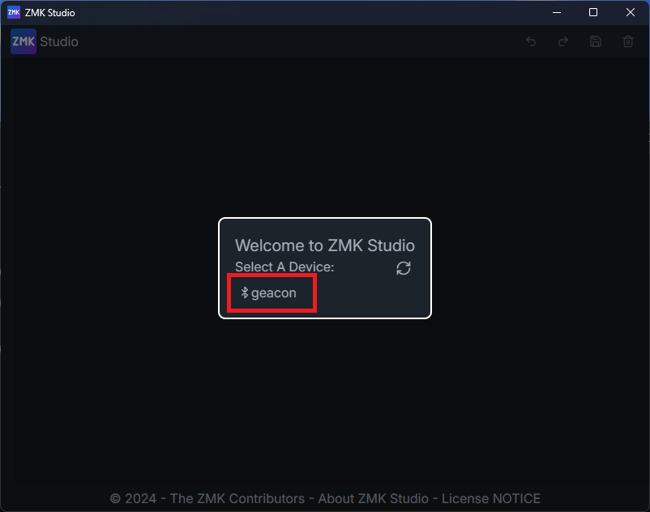

### キーの編集
左ペインでレイヤーを選択  
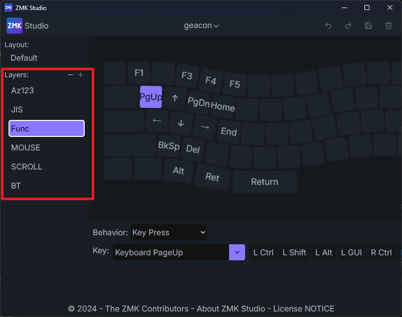

変更したいキーを選択し、下部に表示されるKeyから設定したいキーを選択する。  
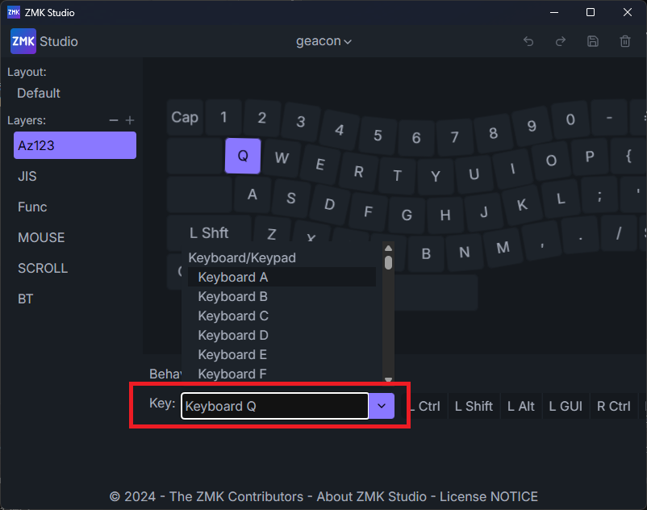

変更を反映するには右上の保存ボタンをクリックする。  
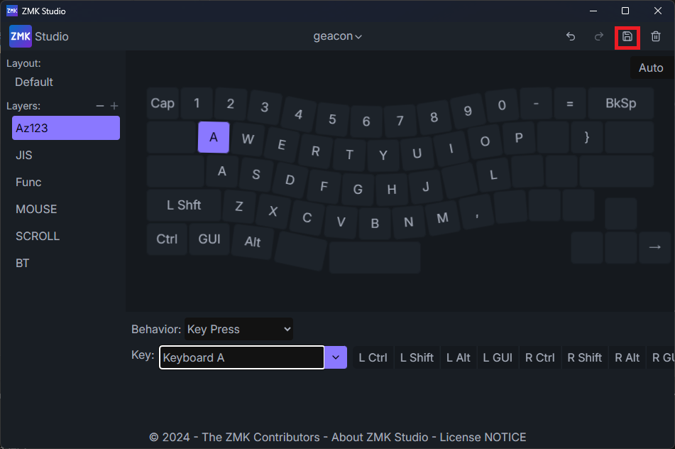

### キーの編集（Keymap Editor）
以下リポジトリをクローンして、ローカルにチェックアウトしておく。  
https://github.com/te9no/zmk-config-te9no  
  
Keymap Editorのページを開く。  
https://nickcoutsos.github.io/keymap-editor/  

File Systemを選択する。  
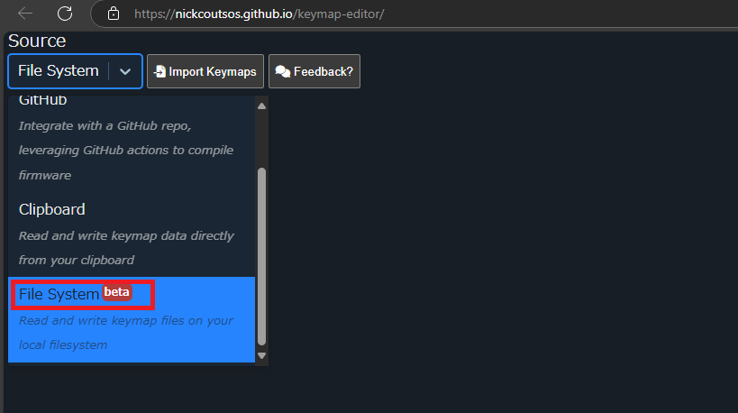

Import Keymapsをクリックする。  
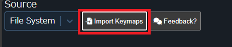

.keymapファイルを選択する。  
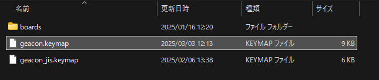

Identify Keyboardをクリックする。  
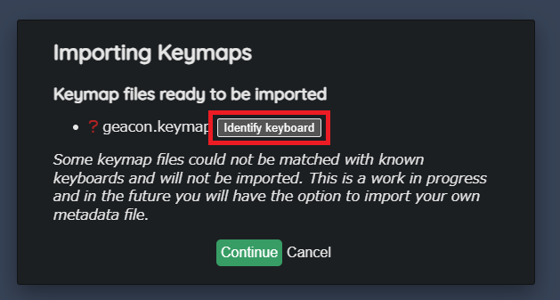

Custom...を選択する。  
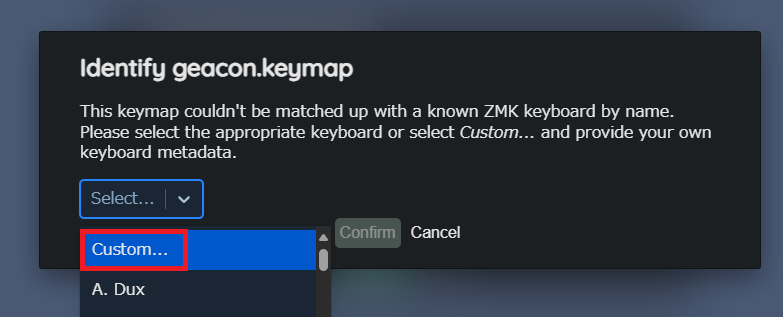

ファイルの選択をクリックする。  
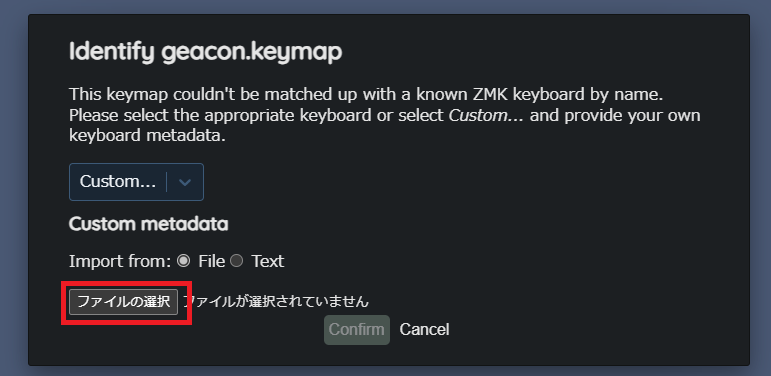

.jsonファイルを選択する。  
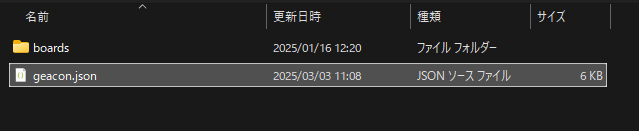

Confirmをクリックする。  
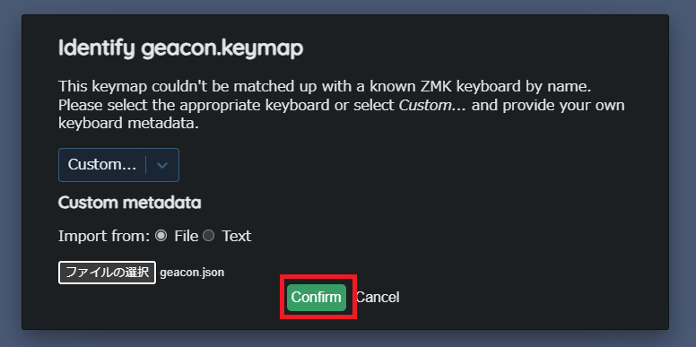

Continueをクリックする。  
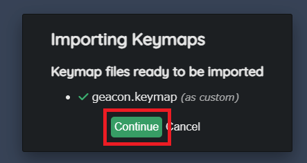

変更したいキーと割り当てを編集し、Saveボタンをクリックしてローカルのファイルへ保存します。\
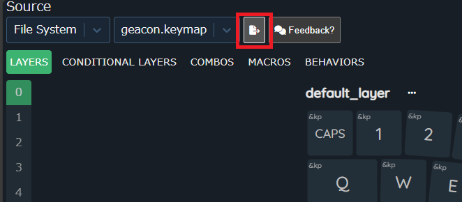

GitHubのリポジトリに変更をプッシュする。\

GitHub Actionでコミットごとにビルドされる。Artifactsからビルドされたファームウェアをダウンロードする。\
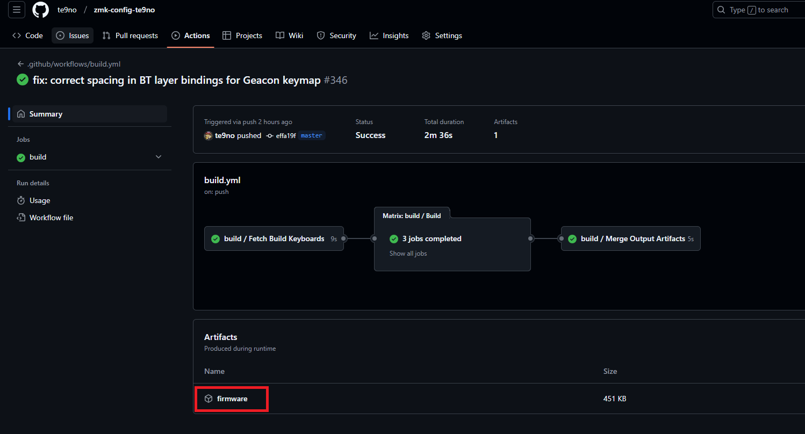

## その他
### 電源スイッチ

電源スイッチは左側でON、右側でOFFとなる。  
 
### PCBの外し方

USBと電池を外してから作業してください。金属工具で基板やバッテリーを傷つけないように注意します。
トラックボールケースを固定しているネジを外す。
トラックボールケースを外す。  
電源スイッチとケースの隙間にマイナスドライバーなどを差し込み、PCBを持ち上げる。  
左端にできたケースとPCBの隙間にカードなどを差し込み、電源スイッチ付近を押し込むと、左下が持ち上がる。  
PCB左側を持ち上げたまま中央部分も持ち上げてケースから外す。
